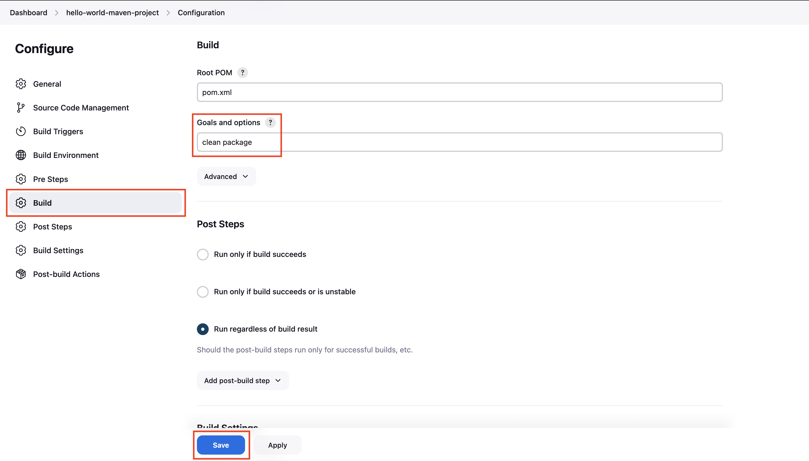

### Create Maven Project

Goto Jenkins dashboard, click on **New Item**


Enter the Maven project name **hello-world-maven-project**, select **Maven project,** and then click **OK**

Install the Maven Integration plugin to see the Maven project option.


Select **Source Code Management** -> **Git** Enter your Public GitHub repository https URL where you have the Maven Java Project

If you do not have a sample Java code, follow these steps to create one

[How to create a GitHub repository and push a sample Java 21 Maven Project](https://devopspilot.com/maven/how-to-create-a-github-repository-and-push-a-sample-java-maven-project/)


Click on **Build**, under **Goals and options** enter **`clean package`** command and then click on **Save**

Since this is a Maven project, there is no need to put **`mvn`** command, only maven goal **`clean package`** is sufficient



Now click on **Build Now** to build the Maven project  
Goto **Console Output**

Here you can see, that it's downloading the Apache maven zip file **apache-maven-3.8.8-bin.zip** from the official maven website, extracting and storing it in the Jenkins tools folder **`/var/lib/jenkins/tools/hudson.tasks.Maven_MavenInstallation/maven-3.8.8`** on the first build

All the Tools defined are downloaded on the first build and stored in a path **/var/lib/jenkins/tools**


You can verify the Maven files downloaded in the Jenkins server

```bash
cd /var/lib/jenkins/tools/
pwd
ls -l
cd hudson.tasks.Maven_MavenInstallation/maven-3.8.8/
ls -l
```

```
root@jenkins-test:~# cd /var/lib/jenkins/tools/
root@jenkins-test:/var/lib/jenkins/tools# pwd
/var/lib/jenkins/tools
root@jenkins-test:/var/lib/jenkins/tools# ls -l
total 4
drwxr-xr-x 3 jenkins jenkins 4096 Jul  8 14:07 hudson.tasks.Maven_MavenInstallation
root@jenkins-test:/var/lib/jenkins/tools# cd hudson.tasks.Maven_MavenInstallation/maven-3.8.8/
root@jenkins-test:/var/lib/jenkins/tools/hudson.tasks.Maven_MavenInstallation/maven-3.8.8# ls -l
total 48
-rwxr-xr-x 1 jenkins jenkins 17264 Mar  8  2023 LICENSE
-rwxr-xr-x 1 jenkins jenkins  5141 Mar  8  2023 NOTICE
-rwxr-xr-x 1 jenkins jenkins  2612 Mar  8  2023 README.txt
drwxr-xr-x 2 jenkins jenkins  4096 Jul  8 14:07 bin
drwxr-xr-x 2 jenkins jenkins  4096 Jul  8 14:07 boot
drwxr-xr-x 3 jenkins jenkins  4096 Jul  8 14:07 conf
drwxr-xr-x 4 jenkins jenkins  4096 Jul  8 14:07 lib
root@jenkins-test:/var/lib/jenkins/tools/hudson.tasks.Maven_MavenInstallation/maven-3.8.8# 
```

Then it executes the maven goal you passed **`clean package`**


Once the build is completed, the war file is created in Maven project Workspace **/var/lib/jenkins/workspace/hello-world-maven-project/target/hello-world-1.0-SNAPSHOT.war**


