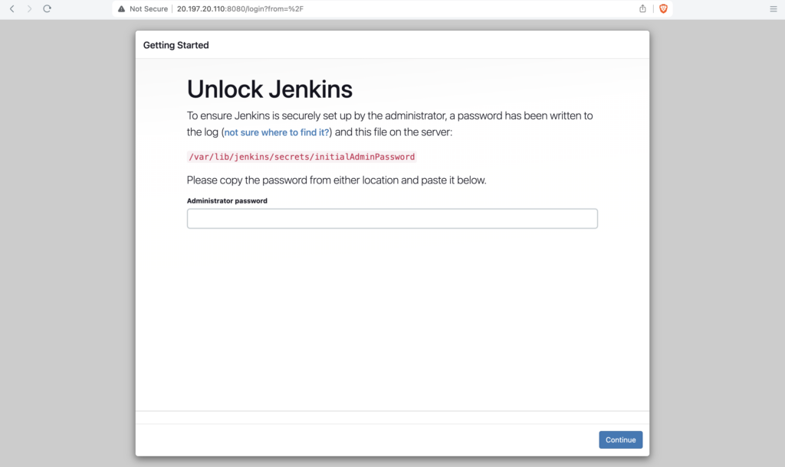
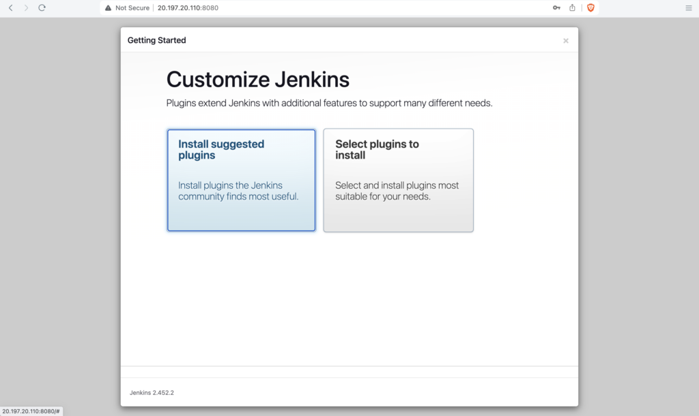
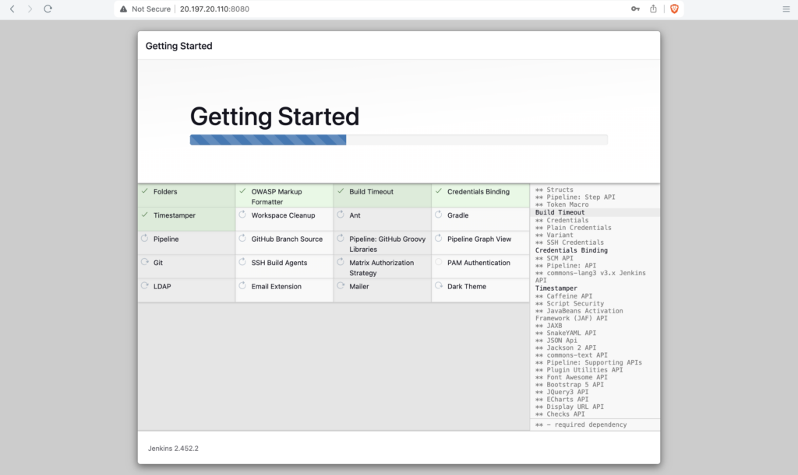
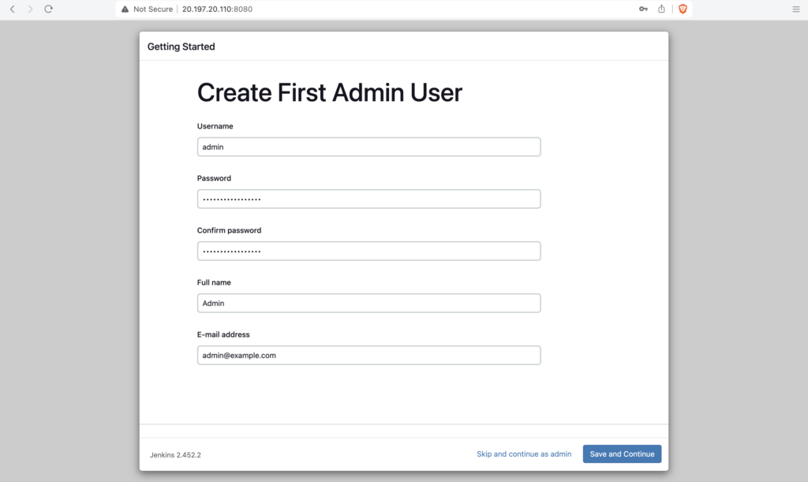
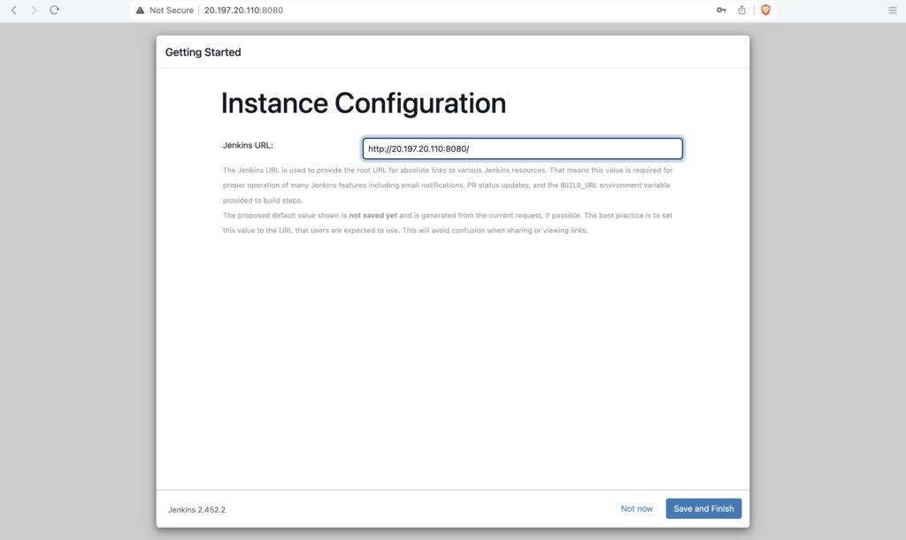
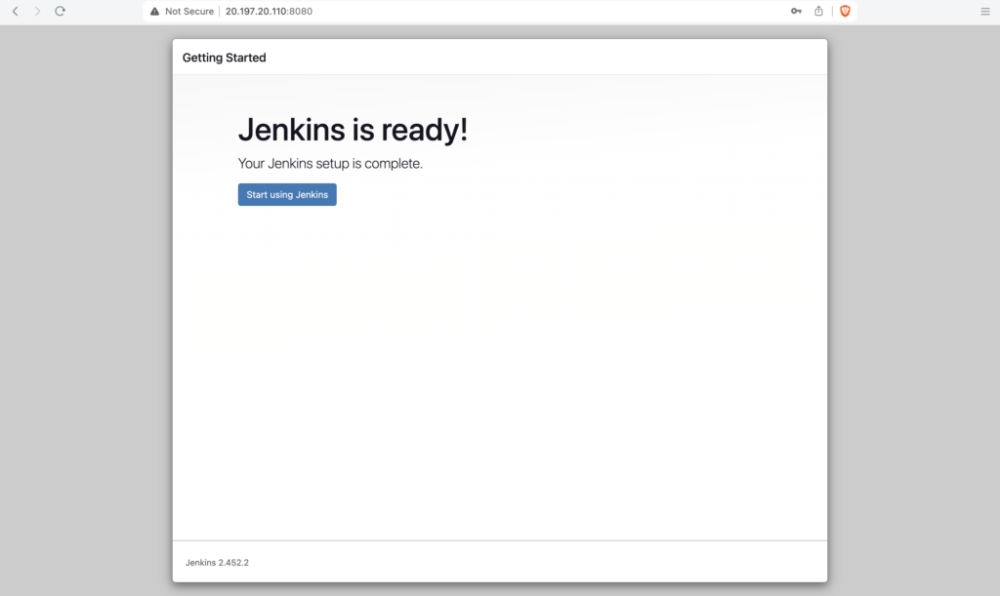
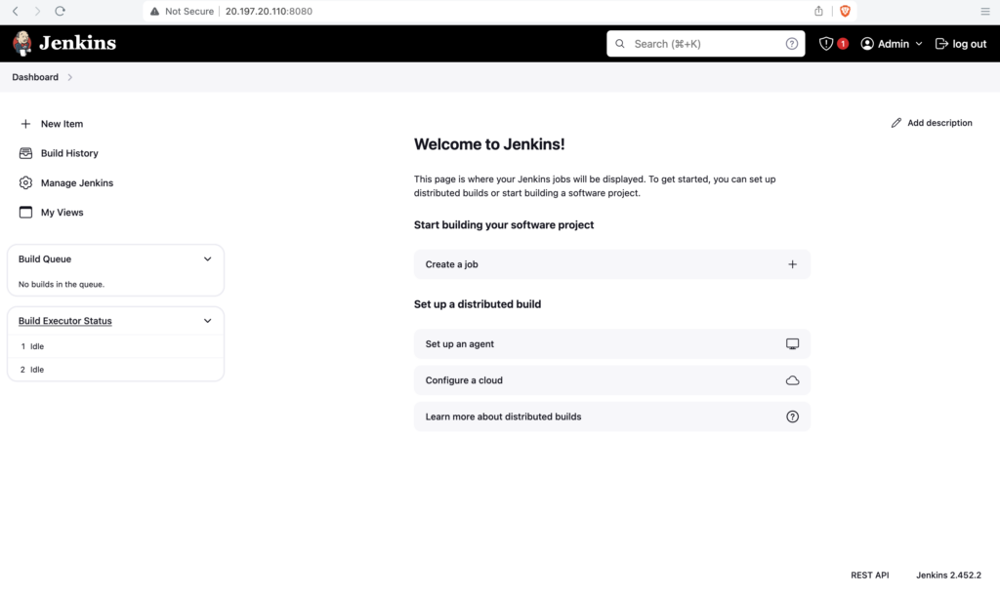

By default, Jenkins starts on port number **8080**

You can access the Jenkins by opening the **ip-address:8080** E.g. **localhost:8080** (if it's installed locally) from the browser



Get the **initialAdminPassword** from a file located in **`/var/lib/jenkins/secrets/initialAdminPassword`**

Change to root user and open the **`/var/lib/jenkins/secrets/initialAdminPassword`** file to get the password

```bash
cat /var/lib/jenkins/secrets/initialAdminPassword
```

```
ubuntu@jenkins-test:~$ sudo su
[sudo] password for ubuntu: 
root@jenkins-test:/home/ubuntu# cat /var/lib/jenkins/secrets/initialAdminPassword

783013afbc7346199ef273fbb8b831bb
```

After entering the password click on **continue**

Click on **Install suggested plugins**



This will automatically install the necessary plugins for Jenkins



Enter the username, password, Fullme, E-mail address and click on **Save and Continue**



Click on **Save and Finish**



Click on **Start using Jenkins**



Jenkins initial setup is complete, you should see the Jenkins Dashboard now



---

## Important Tips

!!! tip
    **Suggested Plugins**: For beginners, always choose "Install suggested plugins". It installs the most commonly used plugins (Git, Pipeline, Ant, Gradle, Mailer, etc.) which covers 90% of use cases.

!!! important
    **Admin User**: Do not lose the password for the first admin user you create. If you skip user creation and continue as "admin", the password remains the initial temporary password found in the log/file.

## 🧠 Quick Quiz — Initial Setup

<quiz>
Where is the **initialAdminPassword** file located on a standard Linux Jenkins installation?
- [ ] /var/log/jenkins/initialAdminPassword
- [x] /var/lib/jenkins/secrets/initialAdminPassword
- [ ] /etc/jenkins/secrets/initialAdminPassword
- [ ] /tmp/initialAdminPassword

This file contains the automatically generated password required for the first-time login to unlock Jenkins.
</quiz>

