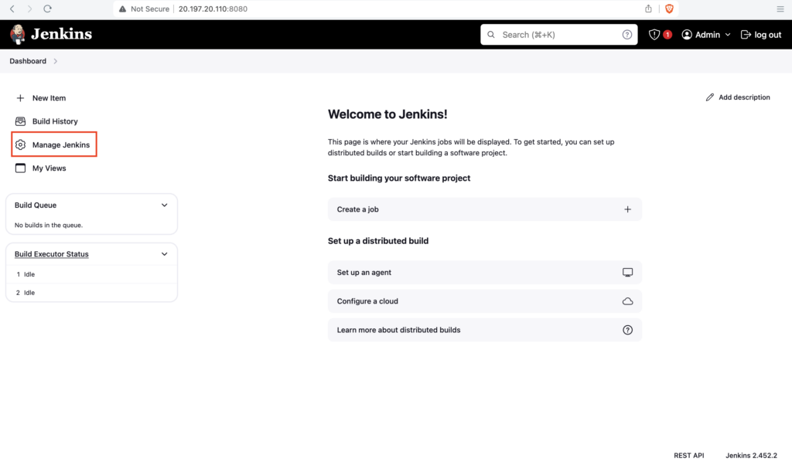
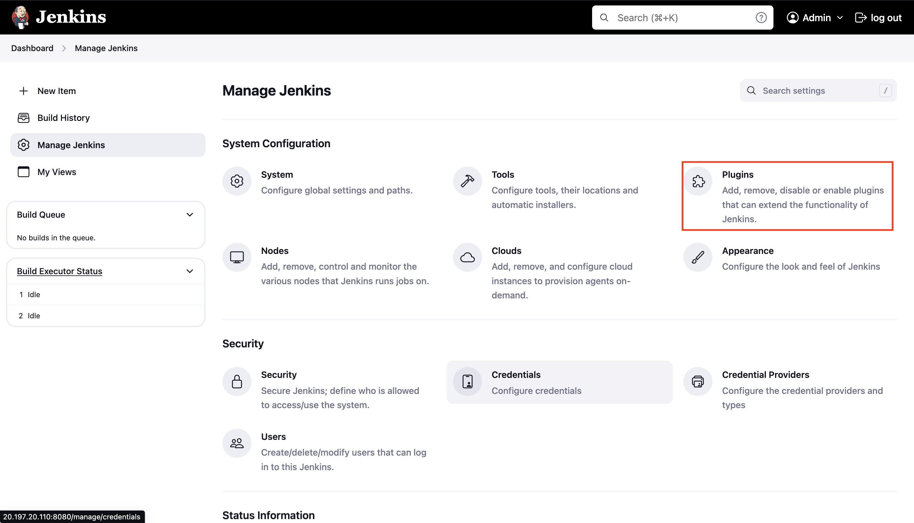
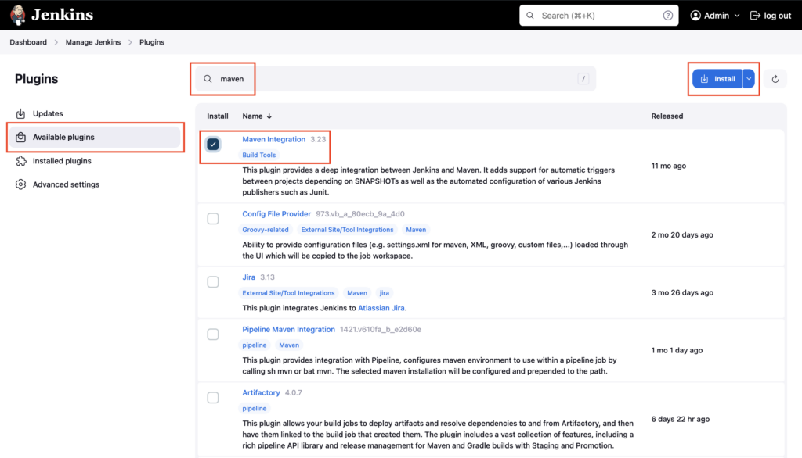
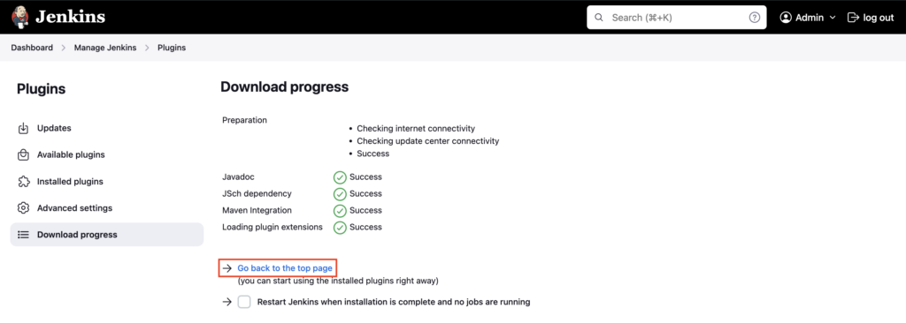

Goto **Jenkins Dashboard**, click on **Manage Jenkins**

Click on **Plugins**

Click on **Available plugins** -> Enter **maven** -> Select **Maven Integration** -> Click on **Install**

**Maven Integration** plugin is installed, click on **Go back to the top page**

---

## Important Tips

!!! tip
    **Restart**: Many plugins require a Jenkins restart to fully activate. You can trigger a safe restart by visiting `YOUR_JENKINS_URL/safeRestart`.

!!! note
    **Dependencies**: When you install a plugin like "Maven Integration", Jenkins effectively manages dependencies and will automatically install other required plugins.

## 🧠 Quick Quiz — Plugin Management

<quiz>
Which menu option in "Manage Jenkins" is used to install new plugins?
- [ ] Configure System
- [ ] Tools
- [x] Plugins
- [ ] Nodes

The **Plugins** (or "Manage Plugins" in older versions) section allows you to search for, install, and update Jenkins plugins.
</quiz>

