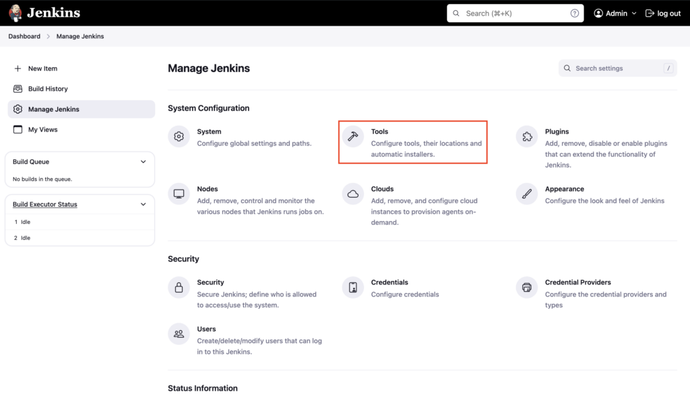
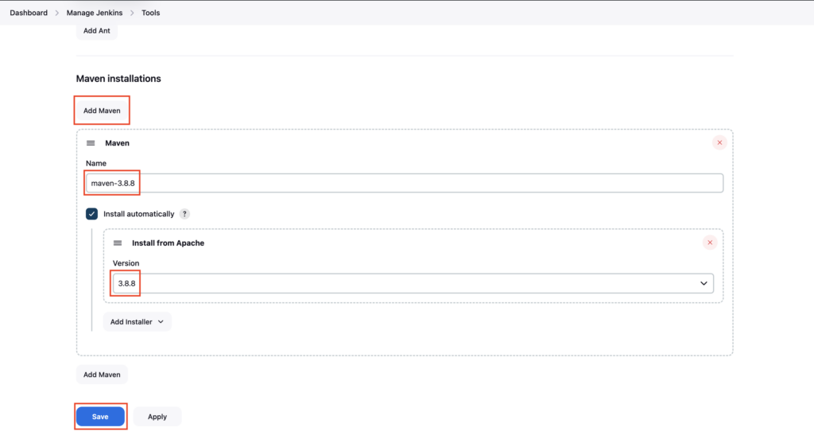

Goto Jenkins dashboard, click on **Manage Jenkins**

Click on **Tools**

Scroll down, under **Maven installations** click on **Add Maven**  
Enter the name **maven-3.8.8** and under version choose **3.8.8** and click on **Save**

Maven will be automatically installed on the Jenkins server in the first build

---

## Important Tips

> [!TIP]
> **Tool Name**: The "Name" you give here (e.g., `maven-3.8.8`) is the exact string you must use in your Jenkinsfile `tools` block. If they don't match, the pipeline will fail.

> [!IMPORTANT]
> **Auto-Install**: The "Install automatically" checkbox is very powerful. It downloads Maven from Apache's servers on the fly. However, in restricted environments (no internet), you might need to point to a local path where Maven is pre-installed.

## 🧠 Quick Quiz — Global Tools

<quiz>
If you configure a specific Maven version (e.g., 3.8.8) in "Global Tool Configuration" and check "Install automatically", when does Jenkins install it?
- [ ] Immediately after saving the configuration.
- [x] During the first build that requests that specific tool.
- [ ] When you restart Jenkins.
- [ ] Never, you must install it manually.

Jenkins downloads and installs the tool (if missing) on the agent/controller only when a pipeline execution requests it.
</quiz>

