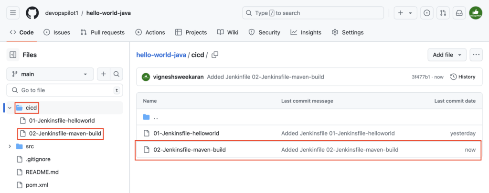
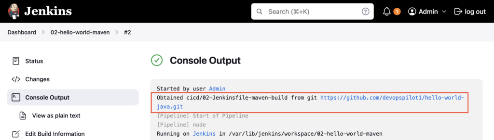
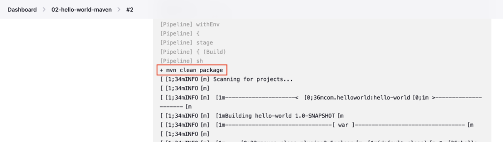
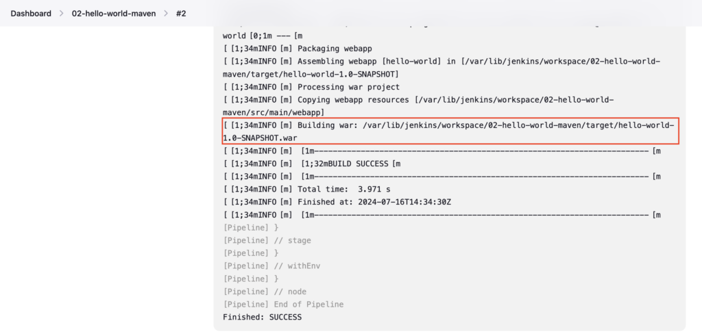

Create a **Jenkinsfile** named **02-Jenkinsfile-maven-build** inside **cicd** folder

```groovy
pipeline {
  agent any
  stages {
    stage ('Build') {
      steps {
        sh 'mvn clean package'
      }
    }
  }
}
```

If you do not have a sample Java code, follow these steps to create one

[How to create a GitHub repository and push a sample Java 21 Maven Project](https://devopspilot.com/maven/how-to-create-a-github-repository-and-push-a-sample-java-maven-project/)

In this Jenkinsfile, you have a single stage named **Build** and you have a **`mvn clean package`** inside the **sh** step

Use the **sh** step to define any shell commands.

Push a **02-Jenkinsfile-maven-build** file to the GitHub repository



Create the Pipeline named **02-hello-world-maven** referring to your GitHub repository and enter **Script Path** as **`cicd/02-Jenkinsfile-maven-build`**

To create a pipeline follow these steps [Click here](https://devopspilot.com/jenkins/course/how-to-create-a-pipeline-in-jenkins-using-jenkinsfile/)

**Build** the pipeline and check the **Console Output**

First **`cicd/02-Jenkinsfile-maven-build`** is obtained from the GitHub repository



Then the **`mvn clean package`** command is executed



Finally, Jenkins creates a **hello-world-1.0-SNAPSHOT.war** file in the **/var/lib/jenkins/workspace/02-hello-world-maven/target** folder.



---

## 🧠 Quick Quiz — Maven Build

<quiz>
Which Maven command is used in the Jenkinsfile to build the project in this tutorial?
- [ ] mvn clean install
- [x] mvn clean package
- [ ] mvn build
- [ ] mvn compile

The tutorial uses `mvn clean package` to clean the target directory and package the code into a JAR/WAR file.
</quiz>

