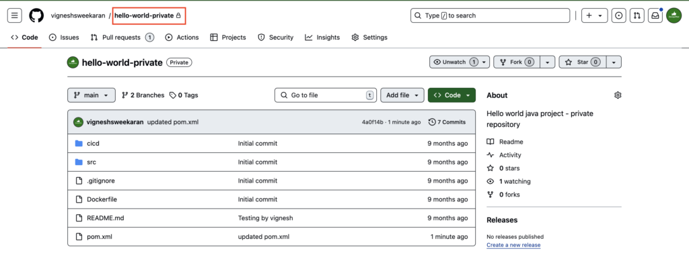
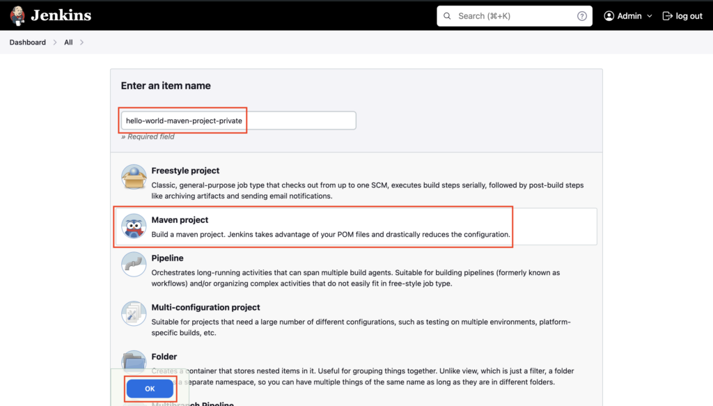
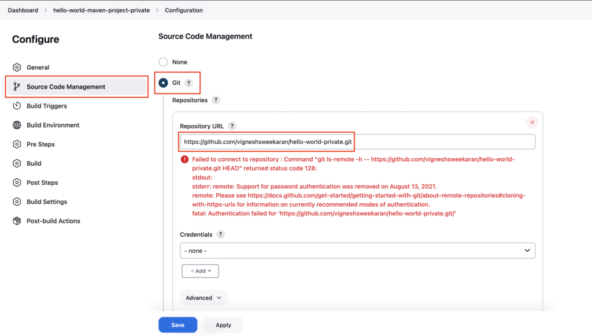
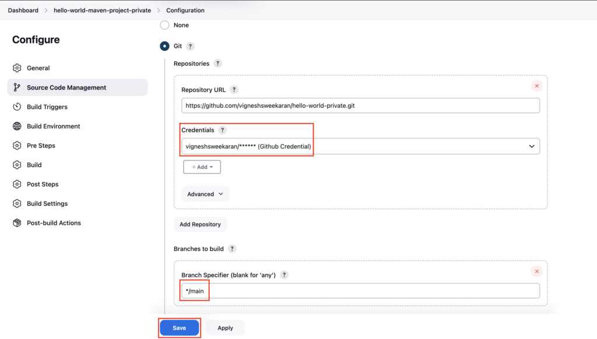
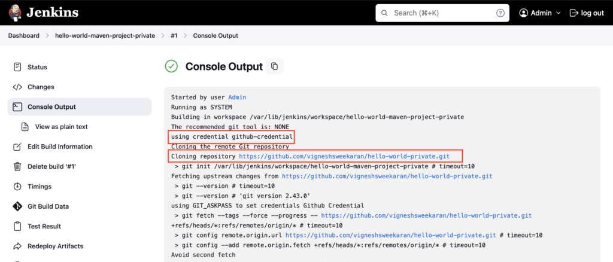

### Create a **Private Github Repository**

### Store the GitHub Token in **Jenkins Credentials**

[How to store a Github Token in Jenkins Credentials](https://devopspilot.com/jenkins/course/how-to-store-a-github-token-safely-in-jenkins-credentials/)

### Create Maven Project

Goto Jenkins dashboard, click on **New Item**  
Enter the Maven project name **hello-world-maven-project-private**, select **Maven project,** and then click **OK**

Select **Source Code Management** -> **Git**  
Enter your **Private GitHub repository** https URL

If you are not selecting the credentials, you will see the above error

Select the created credential **`github-credential`** under **Credentials** section  
Enter the GitHub branch name **`main`** under **Branch Specifier** and then click **Save**

Build the Maven project and check the logs in Console Output, you can see the credential **`github-credential`** is used to clone the **Private** Github repository

---

## 🧠 Quick Quiz — Private Repos

<quiz>
Why might a build fail with an authentication error when cloning a Git repository?
- [ ] The repository is empty.
- [x] The credentials are missing or incorrect for a Private Repository.
- [ ] Jenkins requires a restart.
- [ ] The branch name is "main".

For private repositories, valid credentials (like Username/Password or SSH Key) must be configured in the Source Code Management section to authenticate the clone operation.
</quiz>

