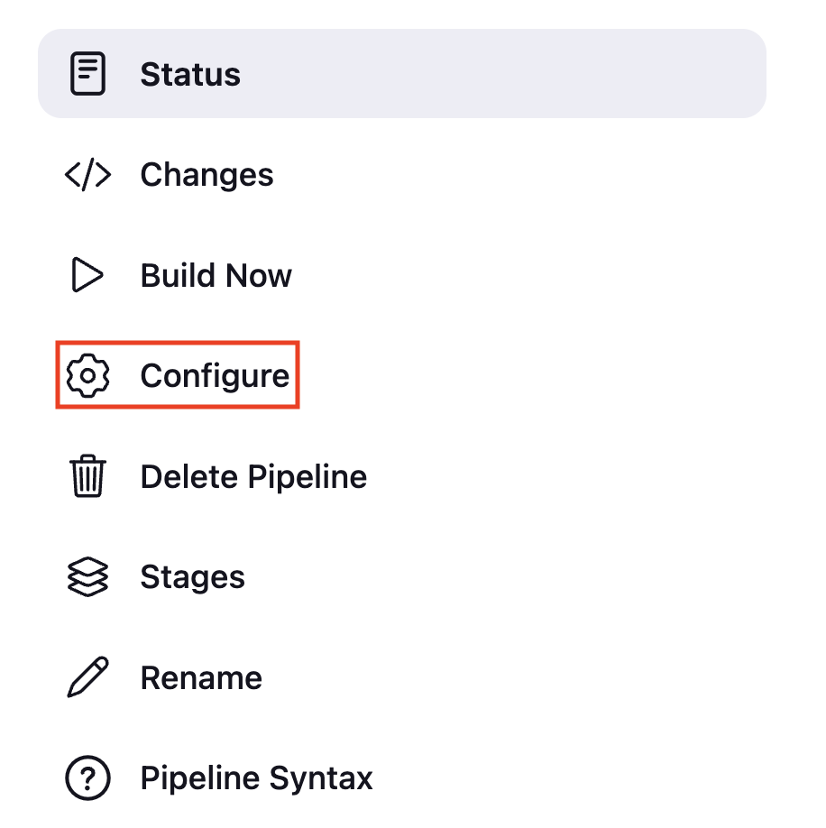
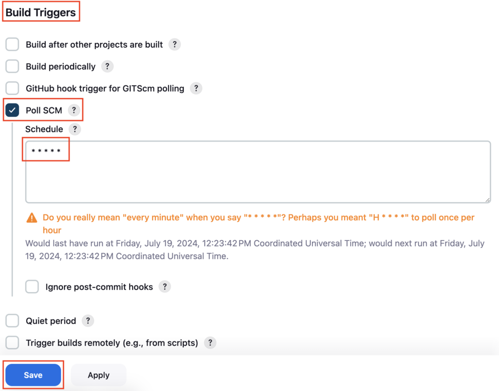
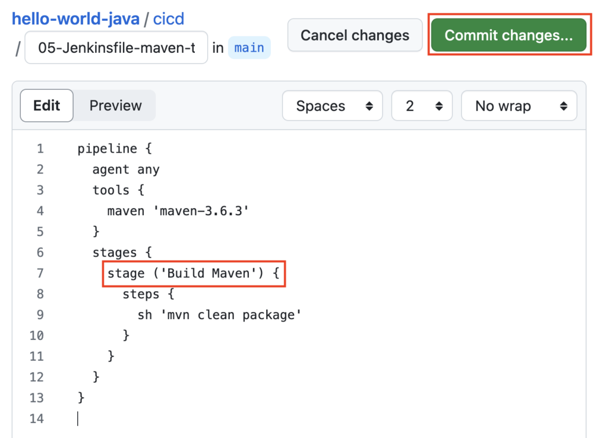
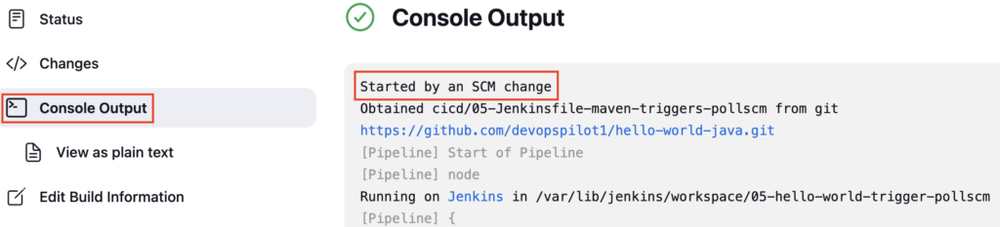
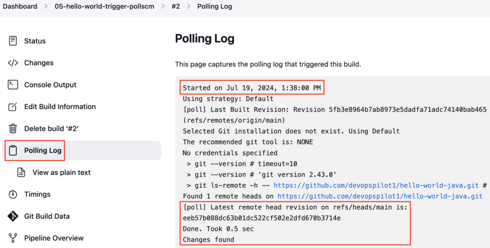
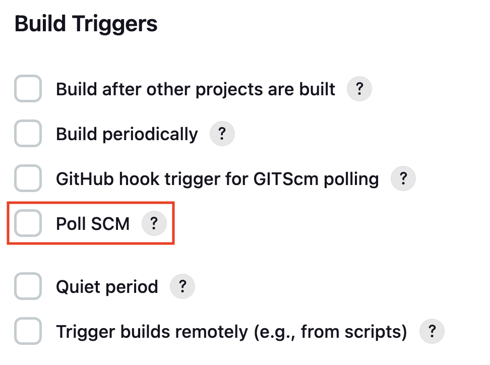
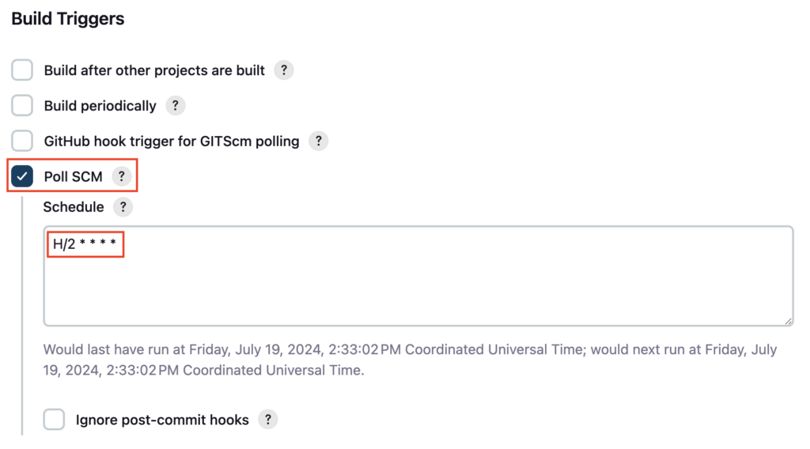

**Poll SCM** is used to check for **changes in the source co**de in the Github repository at **regular intervals**. If it **finds the changes**, it will trigger the Jenkins pipeline.

This is the **reverse way of Webhook**. In the GitHub webhook, GitHub will trigger the pipeline whenever the changes happen.

In Poll SCM. Jenkins will check for changes at regular intervals in the GitHub repository and will trigger the pipeline only if it has changed.

This is mostly useful in the scenario, where Jenkins is installed in a **private network**. where GitHub **cannot reach the Jenkins URL**. In this case, only Jenkins can connect to GitHub to check for changes.

You can define the CRON syntax like **H/5 \* \* \* \*** to check for changes in the GitHub repository **every 5 minutes**

**Reference**: [Jenkins Triggers](https://www.jenkins.io/doc/book/pipeline/syntax/#triggers)

#### Create Pipeline

Create a **Jenkinsfile** named ****05-Jenkinsfile-maven-triggers-poll**scm** inside the **cicd** folder

```groovy
pipeline {
  agent any
  tools {
    maven 'maven-3.6.3' 
  }
  stages {
    stage ('Build') {
      steps {
        sh 'mvn clean package'
      }
    }
  }
}
```

If you do not have a sample Java code, follow these steps to create one

[How to create a GitHub repository and push a sample Java 21 Maven Project](https://devopspilot.com/maven/how-to-create-a-github-repository-and-push-a-sample-java-maven-project/)

Push the ****05-Jenkinsfile-maven-triggers-poll**scm** file to the GitHub repository

Create a Jenkins Pipeline named **05-hello-world-trigger-pollscm** referring to your GitHub repository and enter **Script Path** as **cicd/05-Jenkinsfile-maven-triggers-pollscm**

Click on **Configure**



Under **Build Triggers** enable the **Poll SCM**, under **Schedule** enter **`* * * * *`** and click on **Save**

\* \* \* \* \* -> Every Minute

H/2 \* \* \* \* -> Every 2 Minute



Make a change in ****05-hello-world-trigger-pollscm**** or any File, and **commit the changes**, so that Jenkins can detect the changes and trigger the pipeline

Change the stage name to **Build Maven** and commit the changes



Wait for a minute, the pipeline should be triggered automatically



You can check the **Polling logs** from here



#### Enabling Poll SCM from Jenkinsfile

You have enabled the **Poll SCM** from **Jenkins Pipeline GUI**. You can also do the same from **Jenkinsfile** using the **triggers** block

Previously you have enabled the **Poll SCM** from **Jenkins Pipeline GUI**. You can also enable the **Poll SCM** option and trigger the Jenkins Pipeline using **pollSCM** under the triggers block from **Jenkinsfile**

Uncheck the option **Poll SCM** from Pipeline and click on Save



Let's enable it from Jenkinfile

Add **triggers block** in Jenkinsfile ******05-hello-world-trigger-pollscm******

**`pollSCM 'H/2 * * * *'`** inside the **triggers block** will enable the **Poll SCM** option and set the Schedule to **`H/2 * * * *`** , which will check the GitHub repository for changes every 2 minutes

```groovy
pipeline {
  agent any
  triggers {
    pollSCM 'H/2 * * * *'
  }
  tools {
    maven 'maven-3.6.3' 
  }
  stages {
    stage ('Build Maven') {
      steps {
        sh 'mvn clean package'
      }
    }
  }
}
```

```bash
git diff
```

**OUTPUT:**

```
vignesh ~/code/devopspilot1/hello-world-java/cicd [main] $ git diff
diff --git a/cicd/05-Jenkinsfile-maven-triggers-pollscm b/cicd/05-Jenkinsfile-maven-triggers-pollscm
index 0e3fd6f..41e61ec 100644
--- a/cicd/05-Jenkinsfile-maven-triggers-pollscm
+++ b/cicd/05-Jenkinsfile-maven-triggers-pollscm
@@ -1,5 +1,8 @@
 pipeline {
   agent any
+  triggers {
+    pollSCM 'H/2 * * * *'
+  }
   tools {
     maven 'maven-3.6.3' 
   }
```

Push the changes to your GitHub repository

Manually **Build** the pipeline once and check the pipeline configuration now **Poll SCM** should be enabled with Schedule details



---

## 🧠 Quick Quiz — Poll SCM

<quiz>
What is the key difference between **Poll SCM** and **GitHub Webhook** triggers?
- [ ] Poll SCM is faster.
- [x] Poll SCM periodically asks GitHub for changes, while Webhook waits for GitHub to notify Jenkins.
- [ ] Webhooks cannot trigger pipelines.
- [ ] Poll SCM requires no configuration.

**Poll SCM** is a "pull" mechanism where Jenkins checks for changes on a schedule, whereas **Webhooks** are a "push" mechanism where GitHub notifies Jenkins immediately.
</quiz>

