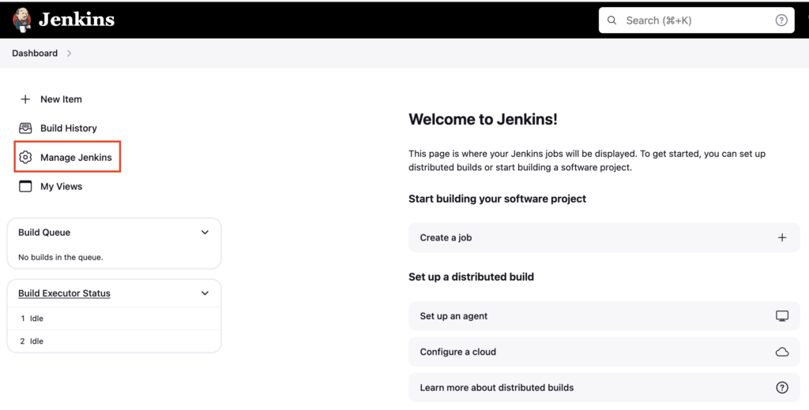
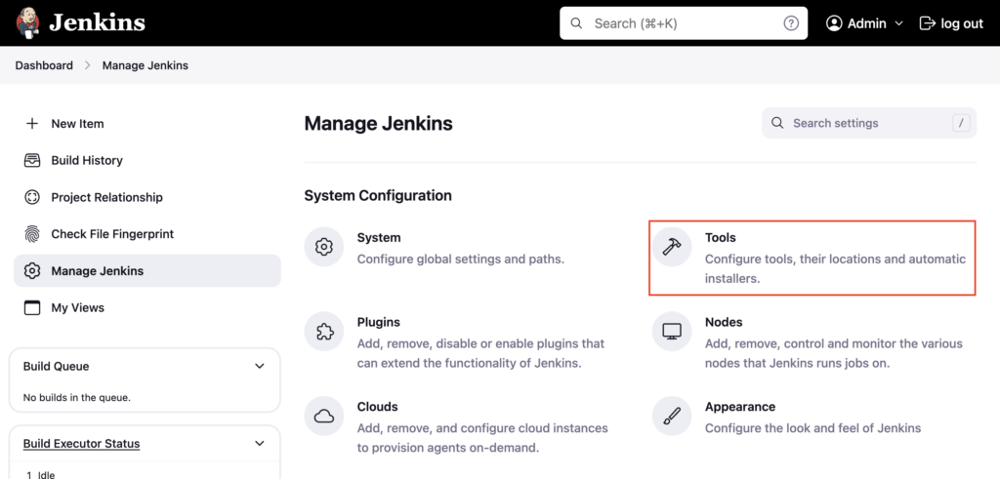
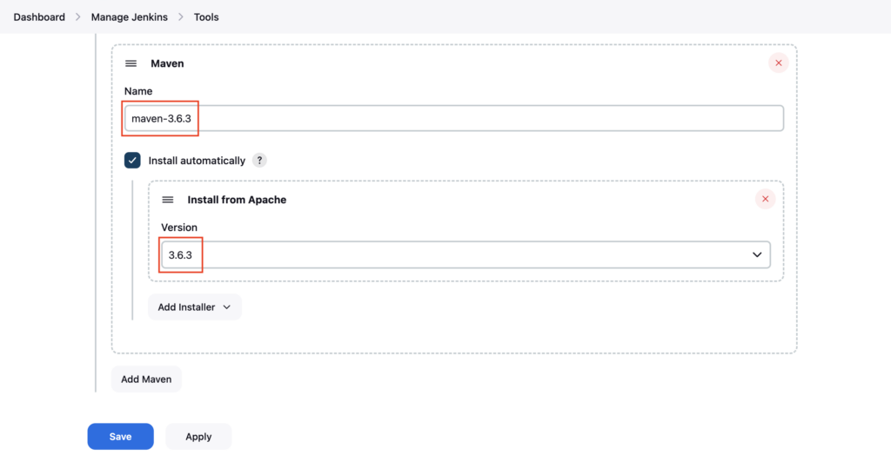
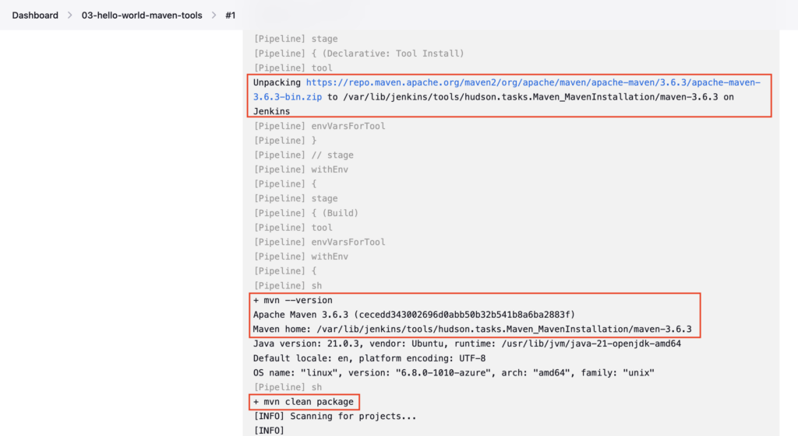
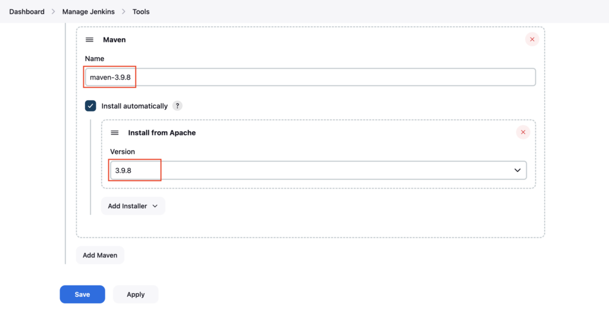
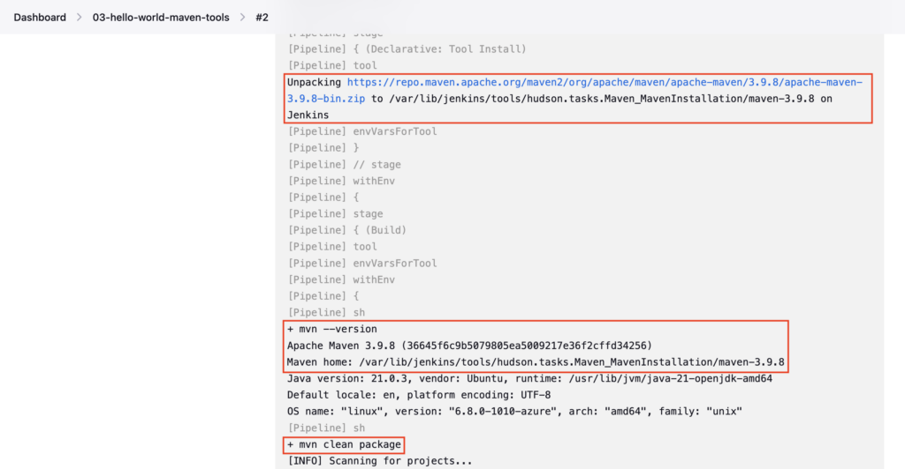

In **Manage Jenkins**, you use the **Tools** options to i**nstall and configure** tools like **Git**, **Maven**, **Gradle**, **Java**, and **Node.js**. Jenkins completely manages tools configured in Jenkins.

You can install and manage **different versions** of **Git**, **maven**, **Gradle**, **Java**, and **NodeJs** from Tools

Using the **tools** block in Jenkinsfile, you can refer to the tools (maven, gradle) configured in **Tools**

### Configure Maven 3.6.3 in Tools

Goto Jenkins dashboard, click on **Manage Jenkins**



Click on **Tools**



Scroll down, under **Maven installations** click on **Add Maven**  
Enter the name **maven-**3.6.3**** and under version choose ****3.6.3**** and click on **Save**



The Jenkins will automatically install Maven 3.6.3 during the first build.

### Create Pipeline

Create a **Jenkinsfile** named **03-Jenkinsfile-maven-build-tools** inside the **cicd** folder

```groovy
pipeline {
  agent any
  tools {
    maven 'maven-3.6.3' 
  }
  stages {
    stage ('Build') {
      steps {
        sh 'mvn --version'
        sh 'mvn clean package'
      }
    }
  }
}
```

If you do not have a sample Java code, follow these steps to create one

[How to create a GitHub repository and push a sample Java 21 Maven Project](https://devopspilot.com/maven/how-to-create-a-github-repository-and-push-a-sample-java-maven-project/)

Here you added the **tools** block and defined **`maven 'maven-3.6.3'`** inside it, which refers to the maven configured in **Tools**

Reference: [Jenkins Tools](https://www.jenkins.io/doc/book/pipeline/syntax/#supported-tools)

Make sure the **Name** configured for Maven in **Tools** matches the same inside the **tools** block

The **`mvn --version`** and **`mvn clean package`** command is added inside the **Build** stage

Push the ****03-Jenkinsfile-maven-build-tools**** file to the GitHub repository

Create the Pipeline named **03-hello-world-maven-tools** referring to your GitHub repository and enter **Script Path** as **`cicd/03-Jenkinsfile-maven-build-tools`**

**Build** the pipeline and check the **Console Output**



In the logs, you can see that Jenkins downloads and configures the Maven 3.6.3 zip in the /var/lib/jenkins/tools folder during the first build.  
Then **`mvn --version`** command is executed to print the Maven version **3.6.3**

You can verify the same in the Jenkins server

```bash
cd /var/lib/jenkins/tools/
ll
```

```
ubuntu@jenkins-test:~$ cd /var/lib/jenkins/tools/
ubuntu@jenkins-test:/var/lib/jenkins/tools$ ll
total 12
drwxr-xr-x  3 jenkins jenkins 4096 Jul  8 14:07 ./
drwxr-xr-x 19 jenkins jenkins 4096 Jul 17 14:27 ../
drwxr-xr-x  4 jenkins jenkins 4096 Jul 17 14:26 hudson.tasks.Maven_MavenInstallation/
```

```bash
cd hudson.tasks.Maven_MavenInstallation/
ll
```

```
ubuntu@jenkins-test:/var/lib/jenkins/tools$ cd hudson.tasks.Maven_MavenInstallation/
ubuntu@jenkins-test:/var/lib/jenkins/tools/hudson.tasks.Maven_MavenInstallation$ ll
total 16
drwxr-xr-x 4 jenkins jenkins 4096 Jul 17 14:26 ./
drwxr-xr-x 3 jenkins jenkins 4096 Jul  8 14:07 ../
drwxr-xr-x 6 jenkins jenkins 4096 Jul 17 14:26 maven-3.6.3/
drwxr-xr-x 6 jenkins jenkins 4096 Jul  8 14:07 maven-3.8.8/
```

```bash
cd maven-3.6.3/
ll
```

```
ubuntu@jenkins-test:/var/lib/jenkins/tools/hudson.tasks.Maven_MavenInstallation$ cd maven-3.6.3/
ubuntu@jenkins-test:/var/lib/jenkins/tools/hudson.tasks.Maven_MavenInstallation/maven-3.6.3$ ll
total 60
drwxr-xr-x 6 jenkins jenkins  4096 Jul 17 14:26 ./
drwxr-xr-x 4 jenkins jenkins  4096 Jul 17 14:26 ../
-rwxr-xr-x 1 jenkins jenkins    99 Jul 17 14:26 .installedFrom*
-rwxr-xr-x 1 jenkins jenkins 17504 Nov  7  2019 LICENSE*
-rwxr-xr-x 1 jenkins jenkins  5141 Nov  7  2019 NOTICE*
-rwxr-xr-x 1 jenkins jenkins  2612 Nov  7  2019 README.txt*
drwxr-xr-x 2 jenkins jenkins  4096 Jul 17 14:26 bin/
drwxr-xr-x 2 jenkins jenkins  4096 Jul 17 14:26 boot/
drwxr-xr-x 3 jenkins jenkins  4096 Jul 17 14:26 conf/
drwxr-xr-x 4 jenkins jenkins  4096 Jul 17 14:26 lib/
```

```bash
cd bin/
ll
./mvn --version
```

```
ubuntu@jenkins-test:/var/lib/jenkins/tools/hudson.tasks.Maven_MavenInstallation/maven-3.6.3$ cd bin/
ubuntu@jenkins-test:/var/lib/jenkins/tools/hudson.tasks.Maven_MavenInstallation/maven-3.6.3/bin$ ll
total 40
drwxr-xr-x 2 jenkins jenkins 4096 Jul 17 14:26 ./
drwxr-xr-x 6 jenkins jenkins 4096 Jul 17 14:26 ../
-rwxr-xr-x 1 jenkins jenkins  228 Nov  7  2019 m2.conf*
-rwxr-xr-x 1 jenkins jenkins 5741 Nov  7  2019 mvn*
-rwxr-xr-x 1 jenkins jenkins 6349 Nov  7  2019 mvn.cmd*
-rwxr-xr-x 1 jenkins jenkins 1485 Nov  7  2019 mvnDebug*
-rwxr-xr-x 1 jenkins jenkins 1668 Nov  7  2019 mvnDebug.cmd*
-rwxr-xr-x 1 jenkins jenkins 1532 Nov  7  2019 mvnyjp*
ubuntu@jenkins-test:/var/lib/jenkins/tools/hudson.tasks.Maven_MavenInstallation/maven-3.6.3/bin$ ./mvn --version
Apache Maven 3.6.3 (cecedd343002696d0abb50b32b541b8a6ba2883f)
Maven home: /var/lib/jenkins/tools/hudson.tasks.Maven_MavenInstallation/maven-3.6.3
Java version: 21.0.3, vendor: Ubuntu, runtime: /usr/lib/jvm/java-21-openjdk-amd64
Default locale: en, platform encoding: UTF-8
OS name: "linux", version: "6.8.0-1010-azure", arch: "amd64", family: "unix"
```

### Configure Maven 3.9.8 in Tools

Enter the name **maven-**3.9.8**** and under version choose ****3.9.8**** and click on **Save**



Update **maven-3.9.8** in Jenkinsfile **03-Jenkinsfile-maven-build-tools**

```groovy
pipeline {
  agent any
  tools {
    maven 'maven-3.9.8' 
  }
  stages {
    stage ('Build') {
      steps {
        sh 'mvn --version'
        sh 'mvn clean package'
      }
    }
  }
}
```

Commit and push the ****03-Jenkinsfile-maven-build-tools**** file changes to the GitHub repository

```
vignesh ~/code/devopspilot1/hello-world-java/cicd [main] $ git diff                           
diff --git a/cicd/03-Jenkinsfile-maven-build-tools b/cicd/03-Jenkinsfile-maven-build-tools
index 89d75ab..d5506af 100644
--- a/cicd/03-Jenkinsfile-maven-build-tools
+++ b/cicd/03-Jenkinsfile-maven-build-tools
@@ -1,7 +1,7 @@
 pipeline {
   agent any
   tools {
- maven 'maven-3.6.3' 
+    maven 'maven-3.9.8'
   }
   stages {
     stage ('Build') {
```

**Build** the pipeline and check the **Console Output**



Jenkins downloads the **Maven 3.9.8 zip** in the **/var/lib/jenkins/tools** folder and then executes the `mvn --version` command to print the Maven version **3.9.8**.

You can verify the same in the Jenkins server

```bash
cd /var/lib/jenkins/tools/hudson.tasks.Maven_MavenInstallation/maven-3.9.8/bin/
ll
./mvn --version
```

```
ubuntu@jenkins-test:~$ cd /var/lib/jenkins/tools/hudson.tasks.Maven_MavenInstallation/maven-3.9.8/bin/
ubuntu@jenkins-test:/var/lib/jenkins/tools/hudson.tasks.Maven_MavenInstallation/maven-3.9.8/bin$ ll
total 40
drwxr-xr-x 2 jenkins jenkins 4096 Jul 17 14:49 ./
drwxr-xr-x 6 jenkins jenkins 4096 Jul 17 14:49 ../
-rwxr-xr-x 1 jenkins jenkins  327 Jun 13 08:21 m2.conf*
-rwxr-xr-x 1 jenkins jenkins 5883 Jun 13 08:21 mvn*
-rwxr-xr-x 1 jenkins jenkins 6324 Jun 13 08:21 mvn.cmd*
-rwxr-xr-x 1 jenkins jenkins 1684 Jun 13 08:21 mvnDebug*
-rwxr-xr-x 1 jenkins jenkins 2169 Jun 13 08:21 mvnDebug.cmd*
-rwxr-xr-x 1 jenkins jenkins 1611 Jun 13 08:21 mvnyjp*
ubuntu@jenkins-test:/var/lib/jenkins/tools/hudson.tasks.Maven_MavenInstallation/maven-3.9.8/bin$ ./mvn --version
Apache Maven 3.9.8 (36645f6c9b5079805ea5009217e36f2cffd34256)
Maven home: /var/lib/jenkins/tools/hudson.tasks.Maven_MavenInstallation/maven-3.9.8
Java version: 21.0.3, vendor: Ubuntu, runtime: /usr/lib/jvm/java-21-openjdk-amd64
Default locale: en, platform encoding: UTF-8
OS name: "linux", version: "6.8.0-1010-azure", arch: "amd64", family: "unix"
```

Like this, you can configure different versions based on your needs.

---

## 🧠 Quick Quiz — Tools Block

<quiz>
What is the purpose of the `tools` block in a Jenkinsfile?
- [x] To auto-install and configure tools (like Maven, JDK) defined in "Manage Jenkins > Tools".
- [ ] To download plugins.
- [ ] To configure the agent's operating system.
- [ ] To manage Jenkins user permissions.

The `tools` block tells Jenkins to install the specified tool (if not present) and add it to the PATH for that pipeline run.
</quiz>

