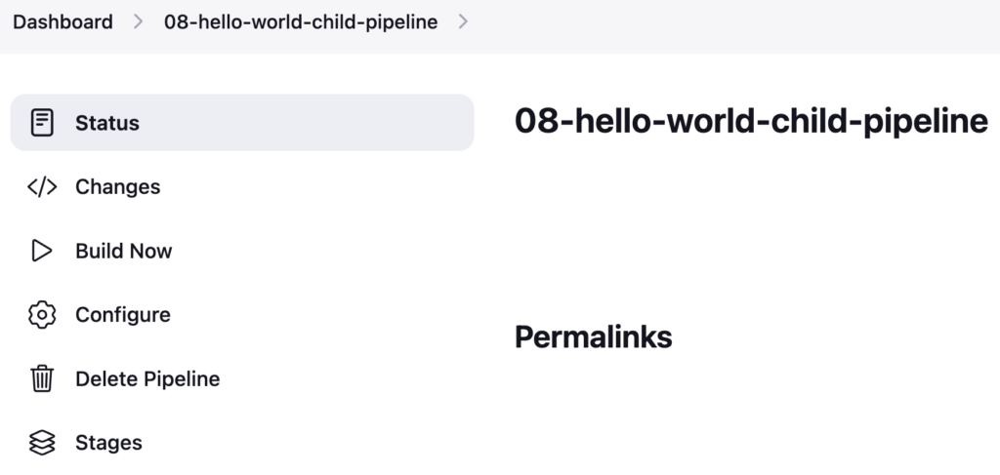
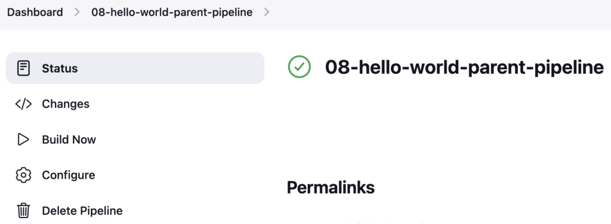
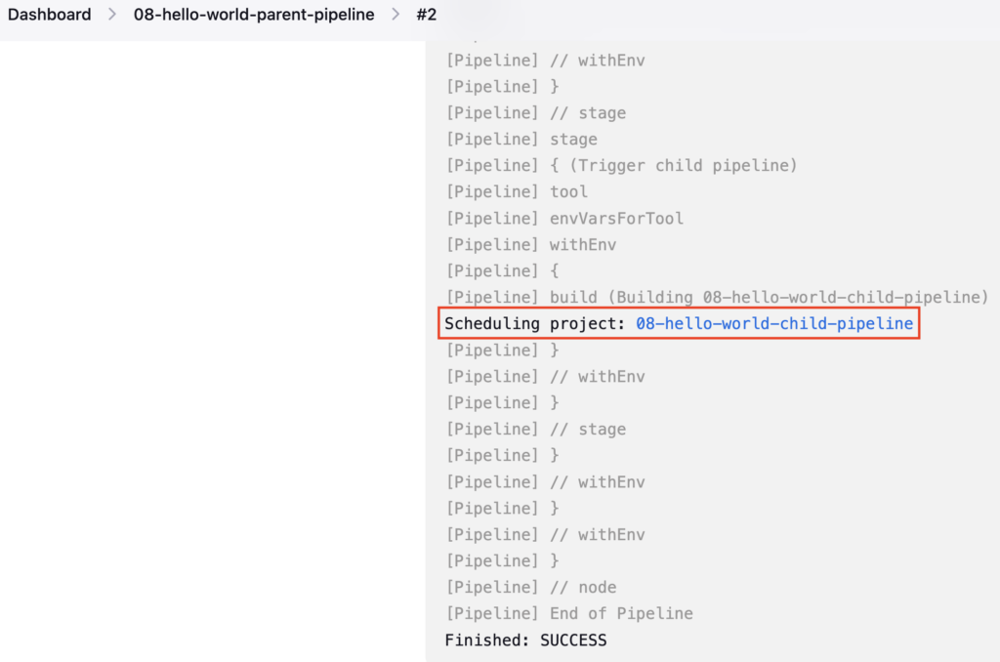
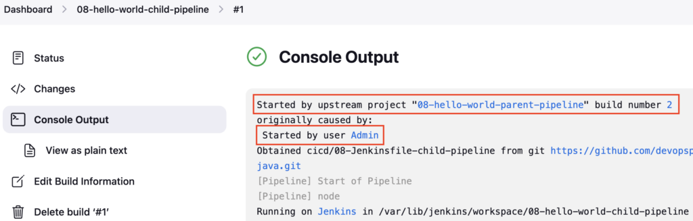
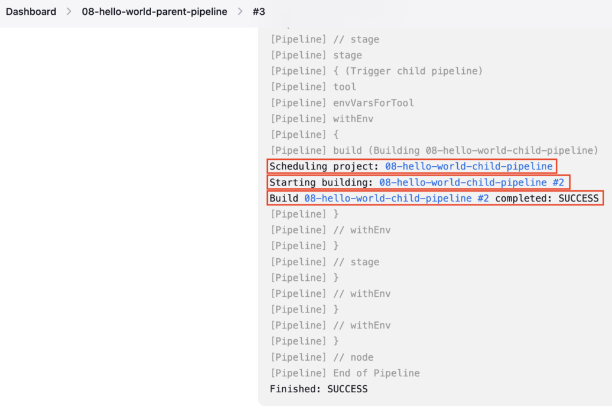

Depending on your project needs, CI/CD pipelines are usually split into multiple pipelines like **Build**, **Test**, **Deployment**, and **Verification**.  
The common scenario is to trigger the deployment Jenkins Pipeline from the stage using Jenkinsfile once the build pipeline is completed

You can even hold the parent pipeline until the child pipeline finishes.

### Create Child Pipeline

Create a **Jenkinsfile** named **`08-Jenkinsfile-child-pipeline`** inside the **cicd** folder

```groovy
pipeline {
  agent any
  tools {
    maven 'maven-3.6.3' 
  }
  stages {
    stage ('Build') {
      steps {
        sh 'mvn clean package'
      }
    }
  }
}
```

If you do not have a sample Java code, follow these steps to create one

[How to create a GitHub repository and push a sample Java 21 Maven Project](https://devopspilot.com/maven/how-to-create-a-github-repository-and-push-a-sample-java-maven-project/)

Push the **08-Jenkinsfile-child-pipeline** file to the GitHub repository

Create a Jenkins Pipeline named **08-hello-world-child-pipeline** referring to your GitHub repository and enter **Script Path** as **`cicd/08-Jenkinsfile-child-pipeline`**



### Parent Pipeline to Trigger Child Pipeline

Create a **Jenkinsfile** named **`08-Jenkinsfile-parent-pipeline`** inside the **cicd** folder

```groovy
pipeline {
  agent any
  tools {
    maven 'maven-3.6.3' 
  }
  stages {
    stage ('Build') {
      steps {
        sh 'mvn clean package'
      }
    }
  }
}
```

Push the **08-Jenkinsfile-parent-pipeline** file to the GitHub repository

Create a Jenkins Pipeline named **08-hello-world-parent-pipeline** referring to your GitHub repository and enter **Script Path** as **`cicd/08-Jenkinsfile-parent-pipeline`**



Add new stage **Trigger child pipeline** after Build stage

```groovy
stage ('Trigger child pipeline') {
  steps {
    build job: '08-hello-world-child-pipeline', wait: false
  }
}
```

Here, the **build** step is used to trigger the child pipeline, you can pass many parameters to the build step. Mostly used parameters are **job** and **wait**

Using the **job** parameter you can pass the child pipeline name E.g. **job: '08-hello-world-child-pipeline'**

**wait** parameter is used to make the parent pipeline to wait until the child pipeline finishes

If you set **wait: true** it will trigger the child pipeline and the parent pipeline will wait until the child pipeline finishes and then resumes.

Similarly, If you set **wait: false** it will just trigger the child pipeline and finish the parent pipeline

Here is an updated Jenkinsfile **`08-Jenkinsfile-child-pipeline`**

```groovy
pipeline {
  agent any
  tools {
    maven 'maven-3.6.3' 
  }
  stages {
    stage ('Build') {
      steps {
        sh 'mvn clean package'
      }
    }
    stage ('Trigger child pipeline') {
      steps {
        build job: '08-hello-world-child-pipeline', wait: false
      }
    }
  }
}
```

Check the diff using the **git diff** command

```bash
git diff
```

**OUTPUT:**

```
vignesh ~/code/devopspilot1/hello-world-java/cicd [main] $ git diff
diff --git a/cicd/08-Jenkinsfile-parent-pipeline b/cicd/08-Jenkinsfile-parent-pipeline
index 0e3fd6f..ad789d1 100644
--- a/cicd/08-Jenkinsfile-parent-pipeline
+++ b/cicd/08-Jenkinsfile-parent-pipeline
@@ -9,5 +9,10 @@ pipeline {
         sh 'mvn clean package'
       }
     }
+    stage ('Trigger child pipeline') {
+      steps {
+        build job: '08-hello-world-child-pipeline', wait: false
+      }
+    }
   }
 }
```

Push the **08-Jenkinsfile-parent-pipeline** file to the GitHub repository

Build the **08-hello-world-parent-pipeline**, and it should trigger the **08-hello-world-child-pipeline** pipeline and it will not wait, since you set **wait: false**



Check the logs of the **08-hello-world-child-pipeline** pipeline, it will show it has been triggered by the Upstream pipeline **08-hello-world-parent-pipeline**



Update **wait: true** in Jenkinsfile **`08-Jenkinsfile-parent-pipeline`**

```groovy
pipeline {
  agent any
  tools {
    maven 'maven-3.6.3' 
  }
  stages {
    stage ('Build') {
      steps {
        sh 'mvn clean package'
      }
    }
    stage ('Trigger child pipeline') {
      steps {
        build job: '08-hello-world-child-pipeline', wait: true
      }
    }
  }
}
```

Check the diff using the **git diff** command

```bash
git diff
```

**OUTPUT:**

```
vignesh ~/code/devopspilot1/hello-world-java/cicd [main] $ git diff
diff --git a/cicd/08-Jenkinsfile-parent-pipeline b/cicd/08-Jenkinsfile-parent-pipeline
index ad789d1..b8c58ea 100644
--- a/cicd/08-Jenkinsfile-parent-pipeline
+++ b/cicd/08-Jenkinsfile-parent-pipeline
@@ -11,7 +11,7 @@ pipeline {
     }
     stage ('Trigger child pipeline') {
       steps {
- build job: '08-hello-world-child-pipeline', wait: false
+        build job: '08-hello-world-child-pipeline', wait: true
       }
     }
   }
```

Push the **08-Jenkinsfile-parent-pipeline** file to the GitHub repository

Build the **08-hello-world-parent-pipeline**, and it should trigger the **08-hello-world-child-pipeline** pipeline and it will wait until the **08-hello-world-child-pipeline** pipeline finishes



In the **08-hello-world-parent-pipeline** pipeline logs, you can see, that it has waited until the child pipeline completes and then it resumes and finishes the pipeline

### Reference:

- [GitHub Repository](https://github.com/vigneshsweekaran/hello-world)

---

## Important Tips

!!! tip
    **Parameters**: You can pass parameters to the downstream job using the `parameters` option: `build job: 'child-job', parameters: [string(name: 'ENV', value: 'prod')]`.

!!! note
    **Deadlocks**: Be careful when chaining too many jobs with `wait: true`. If you exhaust all available executors waiting for downstream jobs, you might create a deadlock where nothing can run.

## 🧠 Quick Quiz — Triggering Jobs

<quiz>
In the `build` step, which parameter ensures the parent pipeline pauses and waits for the downstream job to complete?
- [ ] wait: false
- [x] wait: true
- [ ] async: false
- [ ] sync: true

Setting `wait: true` (which is the default if omitted, but good to be explicit) causes the pipeline step to block until the triggered job finishes.
</quiz>

