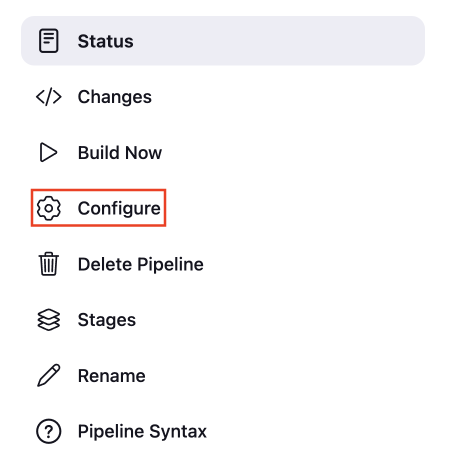

Sometimes you want to trigger the pipeline once the upstream pipeline (parent pipeline) finishes. To achieve this, enable the **`Build after other projects are built`** option from the Jenkins GUI or use the **upstream** keyword inside the **triggers** block in the Jenkinsfile.

### Create Pipeline

Create a **Jenkinsfile** named **07-Jenkinsfile-maven-triggers-upstream** inside the **cicd** folder

```groovy
pipeline {
  agent any
  tools {
    maven 'maven-3.6.3' 
  }
  stages {
    stage ('Build') {
      steps {
        sh 'mvn clean package'
      }
    }
  }
}
```

If you do not have a sample Java code, follow these steps to create one

[How to create a GitHub repository and push a sample Java 21 Maven Project](https://devopspilot.com/maven/how-to-create-a-github-repository-and-push-a-sample-java-maven-project/)

Push the **07-Jenkinsfile-maven-triggers-upstream** file to the GitHub repository

Create a Jenkins Pipeline named **07-hello-world-trigger-upstream** referring to your GitHub repository and enter **Script Path** as **`cicd/07-Jenkinsfile-maven-triggers-upstream`**

Click on **Configure**



Under the Build Triggers section enable **`Build after other projects are built`** option, under the **`Projects to watch`** section, enter your Upstream Pipeline (Parent Pipeline) name and click on **Save**


Use the 01-hello-world-java upstream pipeline as a reference and add your upstream pipeline based on your needs.

By default, the pipeline triggers only when the upstream pipeline status is successful.

If you want to change this behavior, enable the options accordingly

To trigger the pipeline even Parent pipeline **Fails**, enable **Trigger even if the build fails** option


**Trigger** the Pipeline **01-hello-world-java**


Check the logs of the **01-hello-world-java** pipeline, it will show the logs of triggering the **07-hello-world-trigger-upstream**


Now check the 07-hello-world-trigger-upstream; it should trigger.


### Enabling the **upstream** option from Jenkinsfile to trigger the Pipeline

Previously you have enabled the **`Build after other projects are built`** from **Jenkins Pipeline GUI**. You can also enable the **`Build after other projects are built`** option and trigger the Jenkins Pipeline using the **upstream** keyword inside the triggers block from **Jenkinsfile**

Uncheck the option **`Build after other projects are built`** from Pipeline and click on **Save**


Let’s enable it from Jenkinfile

Add **triggers block** in Jenkinsfile **06-Jenkinsfile-maven-triggers-cron**

**`upstream '01-hello-world-java'`** inside the **triggers block** will enable the **`Build after other projects are built`** option and set the **Projects to watch** as **01-hello-world-java**

```groovy
pipeline {
  agent any
  triggers {
    upstream '01-hello-world-java'
  }
  tools {
    maven 'maven-3.6.3'
  }
  stages {
    stage ('Build') {
      steps {
        sh 'mvn clean package'
      }
    }
  }
}
```

**Reference**: [Jenkins Triggers](https://www.jenkins.io/doc/book/pipeline/syntax/#triggers)

Push the changes to your GitHub repository

```bash
git diff
```

```
vignesh ~/code/devopspilot1/hello-world-java/cicd [main] $ git diff
diff --git a/cicd/07-Jenkinsfile-maven-triggers-upstream b/cicd/07-Jenkinsfile-maven-triggers-upstream
index 0e3fd6f..707de7e 100644
--- a/cicd/07-Jenkinsfile-maven-triggers-upstream
+++ b/cicd/07-Jenkinsfile-maven-triggers-upstream
@@ -1,5 +1,8 @@
 pipeline {
   agent any
+  triggers {
+    upstream '01-hello-world-java'
+  }
   tools {
     maven 'maven-3.6.3' 
   }
```

**Build** the pipeline, and check the pipeline configuration now **`Build after other projects are built`** option should be enabled


### Reference:

- [GitHub Repository](https://github.com/vigneshsweekaran/hello-world)

---

## 🧠 Quick Quiz — Upstream Triggers

<quiz>
Which trigger allows a pipeline to start automatically **after** another specific pipeline completes?
- [ ] cron
- [x] upstream
- [ ] githubPush
- [ ] pollSCM

The `upstream` trigger (or "Build after other projects are built") configures the pipeline to listen for the completion of a specified "upstream" project.
</quiz>

