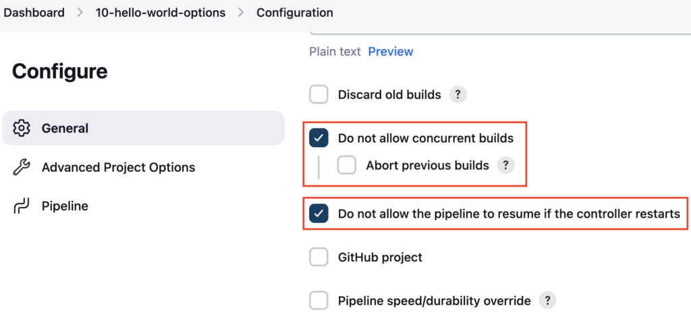
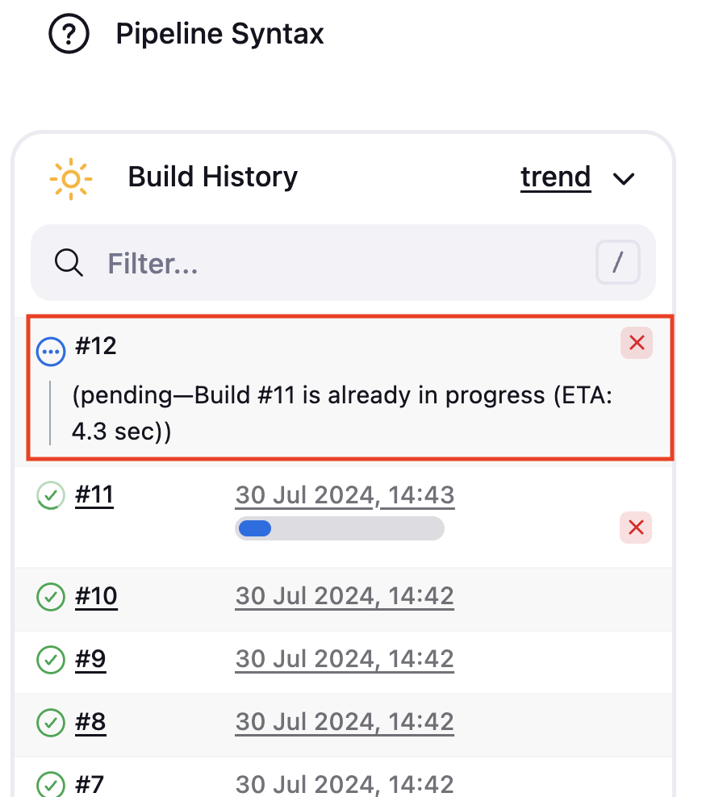
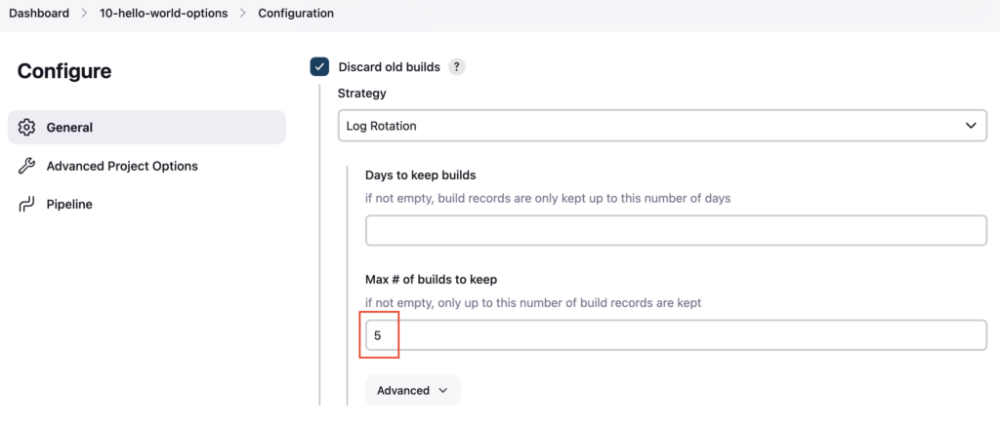
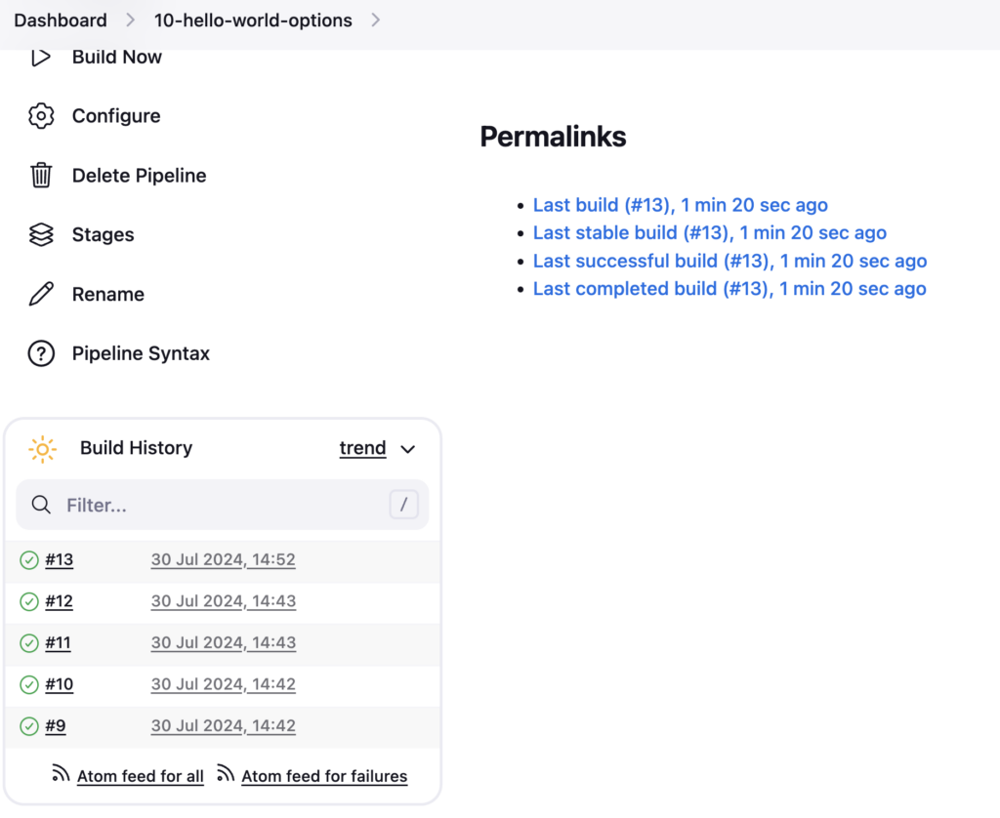
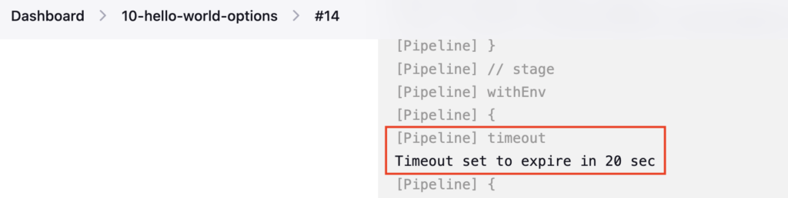
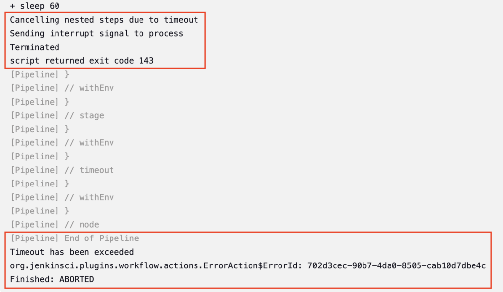
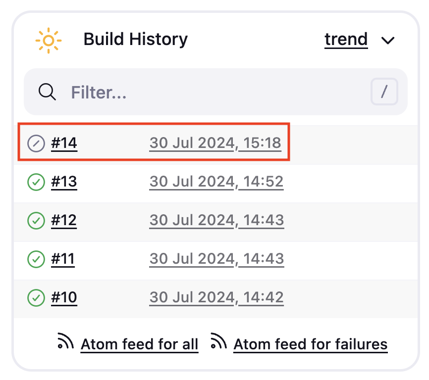

**Options** in Jenkinsfile are used to customize the Jenkins pipeline Configurations, like disabling **concurrent builds**, disabling **Pipeline Resume**, removing the **old pipelines**, and setting a **timeout** for the pipeline

| **Options** | **Details** |
| --- | --- |
| disableConcurrentBuilds() | Used to disable the concurrent running of the Pipeline. Only one pipeline can run at a time |
| disableResume() | Do not allow the pipeline to resume if you are restarting the controller |
| buildDiscarder(logRotator(numToKeepStr: '5')) | Keeps only the last 5 Pipelines and its logs |
| timeout(time: 1, unit: 'HOURS') | Timeout the pipeline if its running for more than 1 Hour |

**Reference**: [Jenkinsfile Options](https://www.jenkins.io/doc/book/pipeline/syntax/#options)

### Create Jenkins Pipeline

Create a **Jenkinsfile** named **10-Jenkinsfile-maven-build-options** inside the **cicd** folder

```groovy
pipeline {
  agent any
  options {
    disableConcurrentBuilds()
    disableResume()
  }
  tools {
    maven 'maven-3.6.3'
  }
  stages {
    stage ('Build') {
      steps {
        sh 'mvn clean package'
      }
    }
  }
}
```

Here in the **options** block, you have added the **disableConcurrentBuilds**() and  
**disableResume**() to disable the concurrent pipeline run and to disable the pipeline to resume when it restarts.

If you do not have a sample Java code, follow these steps to create one

[How to create a GitHub repository and push a sample Java 21 Maven Project](https://devopspilot.com/maven/how-to-create-a-github-repository-and-push-a-sample-java-maven-project/)

Push the **10-Jenkinsfile-maven-build-options** file to the GitHub repository

Create a Jenkins Pipeline named **10-hello-world-options** referring to your GitHub repository and enter **Script Path** as **`cicd/10-Jenkinsfile-maven-build-options`**

### Testing disableConcurrentBuilds() option

Build the Pipeline and check the Pipeline configuration **Do not allow concurrent builds** and **Do not allow the pipeline to resume if the controller restarts** option should be enabled



Now trigger the pipeline 2 times, only 1 pipeline will run and the other pipeline will **wait on the queue**



### Testing buildDiscarder() option

Add **buildDiscarder(logRotator(numToKeepStr: '5'))** it will keep only last 5 pipelines and remove the old pipelines

```groovy
pipeline {
  agent any
  options {
    disableConcurrentBuilds()
    disableResume()
    buildDiscarder(logRotator(numToKeepStr: '5'))
  }
  tools {
    maven 'maven-3.6.3'
  }
  stages {
    stage ('Build') {
      steps {
        sh 'mvn clean package'
      }
    }
  }
}
```

Check the diff using the **git diff** command

```bash
git diff
```

**OUTPUT:**

```
vignesh ~/code/devopspilot1/hello-world-java/cicd [main] $ git diff
diff --git a/cicd/10-Jenkinsfile-maven-build-options b/cicd/10-Jenkinsfile-maven-build-options
index 8063019..d5bd675 100644
--- a/cicd/10-Jenkinsfile-maven-build-options
+++ b/cicd/10-Jenkinsfile-maven-build-options
@@ -3,6 +3,7 @@ pipeline {
   options {
     disableConcurrentBuilds()
     disableResume()
+    buildDiscarder(logRotator(numToKeepStr: '5'))
   }
   tools {
     maven 'maven-3.6.3'
```

Push the **10-Jenkinsfile-maven-build-options** file to the GitHub repository

Trigger the Pipeline and check the Pipeline Configuration



After the build is completed, **the old pipeline runs are deleted and only the** last 5 pipeline executions are kept



You can also **set the days to keep the pipeline executions** and then delete them. E.g. To delete the Pipeline after 30 days

```groovy
buildDiscarder(logRotator(daysToKeepStr: '30'))
```

Similarly, to **keep 5 pipeline executions** and **delete the Pipeline** logs after 30 days

```groovy
buildDiscarder(logRotator(daysToKeepStr: '30', numToKeepStr: '5'))
```

### Testing timeout() option

Add **timeout(time: 20, unit: 'SECONDS')** to the Jenkinsfile, which will timeout(Fail) the pipeline, if its not completed within 20 Seconds

To test this scenario, add the Linux **`sleep 60`** command, which will run the sleep command to make the Build stage sleep for 60 seconds.

```groovy
pipeline {
  agent any
  options {
    disableConcurrentBuilds()
    disableResume()
    buildDiscarder(logRotator(numToKeepStr: '5'))
    timeout(time: 20, unit: 'SECONDS')
  }
  tools {
    maven 'maven-3.6.3'
  }
  stages {
    stage ('Build') {
      steps {
        sh 'mvn clean package'
        sh 'sleep 60'
      }
    }
  }
}
```

```bash
git diff
```

**OUTPUT:**

```
vignesh ~/code/devopspilot1/hello-world-java/cicd [main] $ git diff
diff --git a/cicd/10-Jenkinsfile-maven-build-options b/cicd/10-Jenkinsfile-maven-build-options
index d5bd675..69e8c0e 100644
--- a/cicd/10-Jenkinsfile-maven-build-options
+++ b/cicd/10-Jenkinsfile-maven-build-options
@@ -4,6 +4,7 @@ pipeline {
     disableConcurrentBuilds()
     disableResume()
     buildDiscarder(logRotator(numToKeepStr: '5'))
+    timeout(time: 20, unit: 'SECONDS')
   }
   tools {
     maven 'maven-3.6.3'
@@ -12,6 +13,7 @@ pipeline {
     stage ('Build') {
       steps {
         sh 'mvn clean package'
+        sh 'sleep 60'
       }
     }
   }
```

Push the **10-Jenkinsfile-maven-build-options** file to the GitHub repository

Trigger the Pipeline, it will timeout in 20 seconds







Like this you can configure many configurations for Pipeline from Jenkinsfile.
