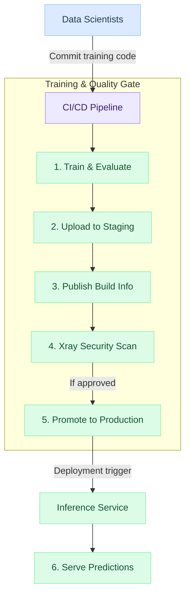

# MLOps Pipeline with JFrog Artifactory

← [Back to JFrog AI & ML](../index.md)

---

A robust MLOps pipeline ensures that every model going to production is **versioned, tested, traceable, and approved**. JFrog Artifactory acts as the artifact hub that connects training infrastructure, CI/CD systems, and inference services.

> All steps use **JFrog SaaS** at `https://<company>.jfrog.io`.

---

## MLOps Pipeline Architecture



---

## Repository Setup for MLOps

Create this repository structure in JFrog SaaS:

```
ml-models-dev-local        → experiment/dev models
ml-models-staging-local    → candidates passing evaluation
ml-models-prod-local       → approved, production models
pypi-virtual               → all Python packages (local + PyPI remote)
```

---

## Step 1: Configure JFrog CLI in Your CI Pipeline

### GitHub Actions:

```yaml
- name: Setup JFrog CLI
  uses: jfrog/setup-jfrog-cli@v4
  env:
    JF_URL: ${{ secrets.JFROG_URL }}
    JF_ACCESS_TOKEN: ${{ secrets.JFROG_TOKEN }}
```

### Jenkins:

```groovy
environment {
    JFROG_URL = credentials('jfrog-url')
    JFROG_TOKEN = credentials('jfrog-token')
}
steps {
    sh "jf config add prod --url ${JFROG_URL} --access-token ${JFROG_TOKEN} --interactive=false"
}
```

---

## Step 2: Train & Evaluate the Model

```python
# train.py
import pickle
from sklearn.ensemble import RandomForestClassifier
from sklearn.metrics import accuracy_score
import os

# Train
X_train, y_train = load_dataset()
model = RandomForestClassifier(n_estimators=100)
model.fit(X_train, y_train)

# Evaluate
accuracy = accuracy_score(y_test, model.predict(X_test))
print(f"Accuracy: {accuracy:.4f}")

# Fail if below threshold
assert accuracy >= 0.90, f"Model accuracy {accuracy} below threshold 0.90"

# Save
with open("model.pkl", "wb") as f:
    pickle.dump(model, f)
```

---

## Step 3: Publish Model to JFrog with Build Info

```bash
# Set build context
export JFROG_CLI_BUILD_NAME=my-ml-model
export JFROG_CLI_BUILD_NUMBER=${GITHUB_RUN_NUMBER}

# Upload model to staging
jf rt upload model.pkl \
  "ml-models-staging-local/my-classifier/${GITHUB_RUN_NUMBER}/model.pkl" \
  --props "accuracy=0.94;framework=sklearn;branch=${GITHUB_REF_NAME};commit=${GITHUB_SHA}"

# Publish build info
jf rt build-publish my-ml-model ${GITHUB_RUN_NUMBER}
```

---

## Step 4: Gate on Xray Security Scan

Add an Xray scan gate in your CI pipeline — it will fail the pipeline if CVEs above your threshold are found in the installed packages:

```bash
# Scan build before promoting
jf rt build-scan my-ml-model ${GITHUB_RUN_NUMBER}
```

Configure Xray **Watch Policies** in the JFrog UI to automatically fail builds that contain high-severity CVEs in their Python dependencies.

---

## Step 5: Promote Approved Models

Once all gates pass (accuracy, security, QA review):

```bash
# Promote from staging to production
jf rt build-promote my-ml-model ${BUILD_NUMBER} \
  --source-repo ml-models-staging-local \
  --target-repo ml-models-prod-local \
  --status "Production" \
  --comment "Approved after accuracy=0.94 and Xray clean scan" \
  --copy=true
```

---

## Step 6: Inference Service Pulls Latest Production Model

```bash
# In Kubernetes init container or startup script
jf rt download \
  --props "env=production" \
  --build-name my-ml-model \
  "ml-models-prod-local/**/*.pkl" /models/
```

Or using REST API in Python:

```python
import requests, os

token = os.environ["JFROG_TOKEN"]
url = "https://<company>.jfrog.io/artifactory/ml-models-prod-local/my-classifier/latest/model.pkl"
resp = requests.get(url, headers={"Authorization": f"Bearer {token}"}, stream=True)
with open("/models/model.pkl", "wb") as f:
    for chunk in resp.iter_content(8192):
        f.write(chunk)
```

---

## Complete GitHub Actions Workflow

```yaml
name: ML Training & Deploy

on:
  push:
    branches: [main]

jobs:
  train-and-publish:
    runs-on: ubuntu-latest
    steps:
      - uses: actions/checkout@v4

      - uses: jfrog/setup-jfrog-cli@v4
        env:
          JF_URL: ${{ secrets.JFROG_URL }}
          JF_ACCESS_TOKEN: ${{ secrets.JFROG_TOKEN }}

      - name: Set up Python
        uses: actions/setup-python@v5
        with:
          python-version: '3.11'

      - name: Install dependencies via JFrog
        run: |
          jf pipc --repo-resolve pypi-virtual
          jf pip install -r requirements.txt

      - name: Train model
        run: python train.py

      - name: Upload model artifact
        run: |
          jf rt upload model.pkl \
            "ml-models-staging-local/my-classifier/${{ github.run_number }}/model.pkl" \
            --props "commit=${{ github.sha }};branch=${{ github.ref_name }}"

      - name: Publish build info
        run: jf rt build-publish my-ml-model ${{ github.run_number }}

      - name: Xray security scan
        run: jf rt build-scan my-ml-model ${{ github.run_number }}

      - name: Promote to production
        if: github.ref == 'refs/heads/main'
        run: |
          jf rt build-promote my-ml-model ${{ github.run_number }} \
            --source-repo ml-models-staging-local \
            --target-repo ml-models-prod-local \
            --status "Production"
```

---

## Next Steps

👉 [AI/ML Security with Xray](../ai-security/index.md)
👉 [Curating AI/ML Packages](../curation-ai-packages/index.md)

---

## 🧠 Quick Quiz

<quiz>
In a JFrog-integrated MLOps pipeline, what is the correct order of operations after model training?
- [ ] Promote → Publish Build Info → Scan → Upload
- [ ] Upload → Promote → Scan → Publish Build Info
- [x] Upload → Publish Build Info → Xray Scan → Promote
- [ ] Scan → Upload → Promote → Publish Build Info

The correct order is: Upload model artifact → Publish build info (links artifact to build) → Xray scan (security gate) → Promote to production if all checks pass.
</quiz>

---


