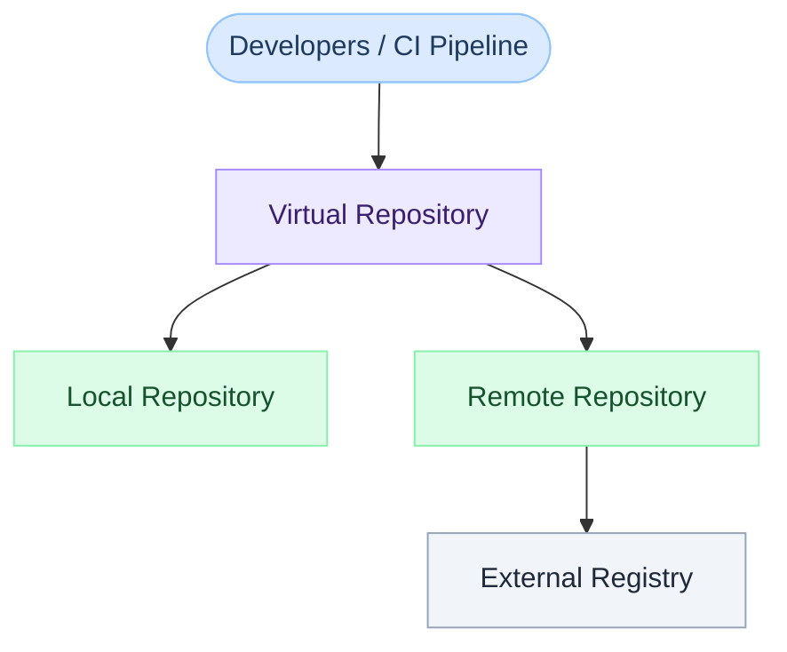
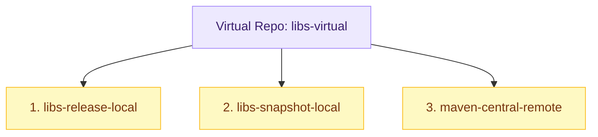

# JFrog Artifactory Key Concepts: Local, Remote & Virtual Repos

← [Back to JFrog Tutorials](../index.md)

---

Before you create your first repository in JFrog Artifactory, it's essential to understand the three foundational repository types. These three types cover every use case in artifact management and are the building blocks of every JFrog workflow.

---

## The Three Repository Types



---

## Local Repository

A **Local Repository** stores artifacts that **your organization produces**.

- Your CI/CD pipeline **publishes** artifacts here after a successful build
- Developers **pull** release or snapshot artifacts from internal builds
- Only your team can publish to it (based on permissions)

### Use Cases
- Storing compiled Maven JARs (`libs-release-local`)
- Publishing Docker images built by Jenkins
- Hosting Helm charts created by your platform team
- Storing custom Terraform modules

### Example Names Convention
```
libs-snapshot-local    → snapshot builds (dev iterations)
libs-release-local     → stable, versioned releases
docker-dev-local       → Docker images from feature branches
docker-prod-local      → Docker images promoted to production
```

### Key Properties
| Property | Value |
|---|---|
| Who writes to it | Your CI/CD pipeline / developers |
| Who reads from it | Developers, other pipelines |
| Storage | JFrog SaaS storage (included in your plan) |
| Re-deployment | Can be enabled or disabled per repo |

---

## Remote Repository

A **Remote Repository** is a **proxy to an external public or private registry**.

When a developer requests a package (e.g., `spring-boot:3.2.0`):
1. Artifactory checks its **local cache** first
2. If not found, it **fetches from the upstream** (e.g., Maven Central)
3. It **caches** the artifact locally
4. **All subsequent requests** are served from cache — internet no longer needed

### Use Cases
- Proxy Maven Central → faster builds, offline capability
- Proxy DockerHub → avoid Docker pull rate limits
- Proxy npmjs.org → reliable npm installs
- Proxy PyPI → consistent Python package resolution

### Example Names Convention
```
maven-central-remote   → proxy of https://repo1.maven.org/maven2
npmjs-remote           → proxy of https://registry.npmjs.org
pypi-remote            → proxy of https://pypi.org/simple
dockerhub-remote       → proxy of https://registry-1.docker.io
```

### Key Properties
| Property | Value |
|---|---|
| Who writes to it | Artifactory automatically (cache from upstream) |
| Who reads from it | Developers, CI pipelines |
| Upstream URL | Configured when you create the repo |
| Cache expiry | Configurable (default: never expire released artifacts) |
| Offline build | ✅ Served from cache when internet is unavailable |

---

## Virtual Repository

A **Virtual Repository** is a **logical aggregation** of one or more Local and Remote repositories, exposed as a **single URL**.

Developers always point their tools (`pom.xml`, `.npmrc`, `pip.conf`) at the **virtual repo URL** — they never need to know about the underlying local/remote split.

### How Resolution Order Works
When a package is requested from a virtual repo, Artifactory searches the underlying repos **in the order you configure**:



### Use Cases
- Give developers **one URL** for all dependencies
- Easily **add/remove** an underlying repo without changing developer config
- **Separate read vs write** — developers read from virtual, CI writes to local

### Example Names Convention
```
libs-virtual           → aggregates release + snapshot + maven-central-remote
docker-virtual         → aggregates docker-dev-local + docker-prod-local + dockerhub-remote
npm-virtual            → npm-local + npmjs-remote
```

### Key Properties
| Property | Value |
|---|---|
| Who writes to it | ❌ Not directly (writes go to a designated local repo) |
| Who reads from it | ✅ Developers and CI pipelines |
| Composed of | One or more Local and/or Remote repos |
| Resolution order | Configurable — repos searched top to bottom |

---

## Side-by-Side Comparison

| Feature | Local | Remote | Virtual |
|---|---|---|---|
| **Purpose** | Store your artifacts | Proxy external registry | Aggregate for single URL |
| **Who publishes** | Your CI/CD pipeline | Artifactory (auto-cache) | Not directly |
| **Who consumes** | Dev + CI | Dev + CI | Dev + CI (primary read point) |
| **Has own storage** | ✅ Yes | ✅ Cache storage | ❌ No (delegates to Local/Remote) |
| **Internet required** | ❌ No | First request only | Depends on underlying |
| **Default deployment target** | ✅ Typical publish target | ❌ No | ✅ Can route to a local repo |

---

## Real-World Maven Example

A typical Maven setup in Artifactory looks like this:

```
libs-snapshot-local    [LOCAL]  → CI publishes SNAPSHOT builds here
libs-release-local     [LOCAL]  → CI publishes versioned releases here
maven-central-remote   [REMOTE] → proxy of https://repo1.maven.org/maven2
libs-virtual           [VIRTUAL]→ aggregates all three above
```

Developers add this to `~/.m2/settings.xml`:
```xml
<mirror>
  <id>jfrog-artifactory</id>
  <mirrorOf>*</mirrorOf>
  <url>https://<company>.jfrog.io/artifactory/libs-virtual</url>
</mirror>
```

All Maven dependency resolution and publishing now goes **through Artifactory only**.

---

## Next Steps

👉 [Getting Started with JFrog SaaS](../getting-started-saas/index.md)
👉 [Maven Repositories — Full Walkthrough](../maven-repositories/index.md)

---

## 🧠 Quick Quiz

<quiz>
Which repository type should developers and CI pipelines use as their primary read/resolve URL?
- [ ] Local Repository
- [ ] Remote Repository
- [x] Virtual Repository
- [ ] Distribution Repository

The Virtual Repository aggregates Local and Remote repos into a single URL, making it the best endpoint for developers and CI tools to point their package managers at.
</quiz>

---


