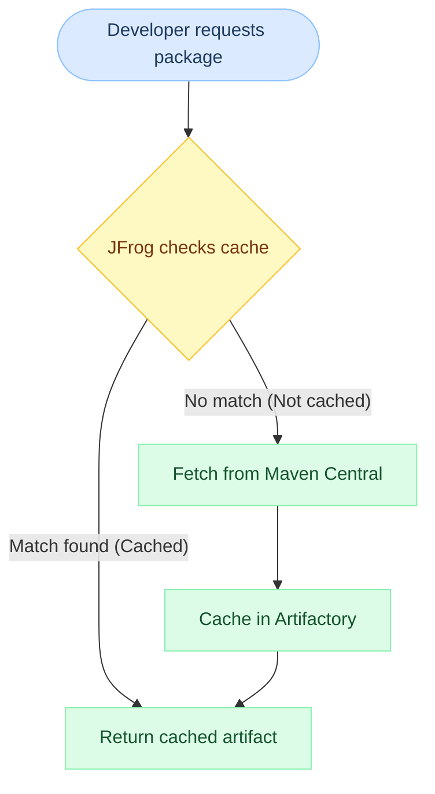

# Maven Repositories in JFrog Artifactory

← [Back to JFrog Tutorials](../index.md)

---

Maven is one of the most popular build tools for Java projects. JFrog Artifactory provides **first-class Maven support** — acting as a proxy for Maven Central, a home for your in-house JARs, and a single unified endpoint for all Maven resolution.

> All steps below use **JFrog SaaS** at `https://<company>.jfrog.io`.

---

## What You'll Build

By the end of this tutorial you will have:

```
maven-snapshots-local  [LOCAL]  → your team's SNAPSHOT builds
maven-releases-local   [LOCAL]  → your team's versioned releases
maven-central-remote   [REMOTE] → proxy of Maven Central
maven-virtual          [VIRTUAL]→ single URL aggregating all three
```

---

## Step 1: Create a Local Repository — Snapshots

Local repositories store **artifacts produced by your team**.

1. Go to **Administration → Repositories → + New Repository**
2. Select **Local**
3. Choose **Maven** as the package type
4. Set **Repository Key**: `maven-snapshots-local`
5. Under **Maven Settings**:
   - **Handle Releases**: ❌ Off
   - **Handle Snapshots**: ✅ On
   - **Suppress POM Consistency Checks**: Off (leave default)
6. Click **Create Local Repository**

---

## Step 2: Create a Local Repository — Releases

1. Repeat the process, this time set **Repository Key**: `maven-releases-local`
2. Under **Maven Settings**:
   - **Handle Releases**: ✅ On
   - **Handle Snapshots**: ❌ Off
3. Click **Create Local Repository**

### Why Two Local Repos?

| Repo | Contains | Redeploy Allowed? |
|---|---|---|
| `maven-snapshots-local` | `-SNAPSHOT` builds from dev | ✅ Yes (snapshots change often) |
| `maven-releases-local` | Stable `1.0.0`, `2.3.1` releases | ❌ No (immutable once released) |

---

## Step 3: Create a Remote Repository — Maven Central

A Remote Repository proxies Maven Central and caches downloaded artifacts.

1. Go to **Administration → Repositories → + New Repository**
2. Select **Remote**
3. Choose **Maven**
4. Set **Repository Key**: `maven-central-remote`
5. Set **URL**: `https://repo1.maven.org/maven2`
6. Leave other settings as default
7. Click **Create Remote Repository**

### What happens behind the scenes?



---

## Step 4: Create a Virtual Repository

The Virtual Repository gives developers and CI pipelines **one single URL**.

1. Go to **Administration → Repositories → + New Repository**
2. Select **Virtual**
3. Choose **Maven**
4. Set **Repository Key**: `maven-virtual`
5. Under **Repositories**, add them in this order:
   - `maven-releases-local`
   - `maven-snapshots-local`
   - `maven-central-remote`
6. Set **Default Deployment Repository**: `maven-snapshots-local`
   *(CI publishes SNAPSHOTs by default; releases need explicit config)*
7. Click **Create Virtual Repository**

---

## Step 5: Configure Maven to Use JFrog SaaS

### Option A: `~/.m2/settings.xml` (Recommended)

Add this to your Maven `settings.xml` to route all dependency resolution through JFrog:

```xml
<settings>
  <servers>
    <server>
      <id>jfrog-artifactory</id>
      <username>your-username</username>
      <password>your-access-token</password>
    </server>
  </servers>

  <mirrors>
    <mirror>
      <id>jfrog-artifactory</id>
      <mirrorOf>*</mirrorOf>
      <url>https://<company>.jfrog.io/artifactory/maven-virtual</url>
    </mirror>
  </mirrors>

  <profiles>
    <profile>
      <id>jfrog</id>
      <repositories>
        <repository>
          <id>jfrog-artifactory</id>
          <url>https://<company>.jfrog.io/artifactory/maven-virtual</url>
        </repository>
      </repositories>
    </profile>
  </profiles>
  <activeProfiles>
    <activeProfile>jfrog</activeProfile>
  </activeProfiles>
</settings>
```

### Option B: `pom.xml` (Per-project)

Add the distribution management section to publish artifacts:

```xml
<distributionManagement>
  <repository>
    <id>jfrog-artifactory</id>
    <url>https://<company>.jfrog.io/artifactory/maven-releases-local</url>
  </repository>
  <snapshotRepository>
    <id>jfrog-artifactory</id>
    <url>https://<company>.jfrog.io/artifactory/maven-snapshots-local</url>
  </snapshotRepository>
</distributionManagement>
```

---

## Step 6: Publish an Artifact

Run the Maven deploy command:

```bash
mvn deploy
```

After a successful build, navigate to **Application → Artifactory → Artifacts** to see your JAR in `maven-snapshots-local` or `maven-releases-local`.

---

## Repository Comparison Summary

| Feature | Local | Remote | Virtual |
|---|---|---|---|
| **Stores your builds** | ✅ | ❌ | ❌ |
| **Proxies Maven Central** | ❌ | ✅ | ❌ |
| **Single URL for devs** | ❌ | ❌ | ✅ |
| **Publish target for CI** | ✅ | ❌ | Delegates to local |
| **Resolve dependencies** | ✅ | ✅ | ✅ (best choice) |
| **Network isolation** | Partial | Full cache | Full (via remote) |

---

## Use Cases

| Scenario | Solution |
|---|---|
| Developer pulls `spring-boot` dependency | Remote repo proxies Maven Central, caches locally |
| CI publishes a `1.0.0-SNAPSHOT` JAR | Deploys to `maven-snapshots-local` |
| CI promotes a release to `1.0.0` | Deploys to `maven-releases-local` |
| New developer joins — one line of config needed | Point `settings.xml` mirror to `maven-virtual` |
| Maven Central is down | Builds still work — all cached in remote repo |

---

## Next Steps

👉 [Docker Repositories](../docker-repositories/index.md)
👉 [Build Info & Promotion](../build-info-promotion/index.md)
👉 [JFrog CLI Basics](../jfrog-cli/index.md)

---

## 🧠 Quick Quiz

<quiz>
What is the recommended deployment target repository when using a Virtual Maven repository?
- [ ] The Virtual repository itself
- [ ] The Remote repository (Maven Central proxy)
- [x] A Local repository (configured as the default deployment target)
- [ ] Any repository in random order

Virtual repositories do not store artifacts directly. You configure a Local repository as the "Default Deployment Repository" on the Virtual repo. Deploys are routed there while resolves span all included repos.
</quiz>

---


