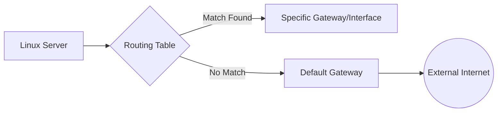

# Linux Routing Basics (ip route)

← [Back to Linux Commands](../index.md)

---

Routing is the process by which a Linux kernel determines where to send network packets. Whether a packet is destined for a local server or a remote website, the **Routing Table** acts as the system's internal map. In modern Linux, the <k>ip route</k> utility is the primary tool for inspecting and manipulating this map.



---

### 1. Viewing the Routing Table

To see the current map of network paths, use the `show` object of the `ip route` command.

```bash
ip route show
```

**Common Output Fields:**

- **default**: The catch-all route for any traffic not matching other entries.
- **via**: The IP address of the gateway (router).
- **dev**: The network interface (e.g., `eth0`, `wlan0`).
- **proto kernel**: Indicates the route was created automatically by the kernel.
- **metric**: The priority of the route (lower values have higher priority).

---

### 2. Managing the Default Gateway

The default gateway is the most critical entry in your routing table. Without it, your server cannot communicate with any host outside its immediate local subnet.

**Adding a Default Gateway:**
If your server loses its gateway, you can manually restore it:

```bash
sudo ip route add default via 10.0.0.1 dev eth0
```

> [!TIP]
> Always verify that the gateway IP (`via`) is reachable within your local subnet before adding it, or the route will remain inactive.

---

### 3. Creating Static Routes

Static routes are manual entries used to direct traffic for specific IPs or subnets through non-standard paths.

**Host Route (Single IP):**
Direct traffic for a specific server through a dedicated interface:

```bash
sudo ip route add 1.1.1.1 dev eth0
```

**Network Route (Subnet):**
Route an entire subnet (using CIDR notation) through a specific gateway:

```bash
sudo ip route add 192.168.100.0/24 via 10.0.0.1
```

---

### 4. Deleting Routes

To avoid routing conflicts or clean up temporary paths, you can remove entries using the `del` command.

```bash
sudo ip route del 192.168.100.0/24
```

---

### 5. Persistence and Runtime State

Commands executed with <k>ip route</k> are applied directly to the kernel's **runtime memory**.

> [!IMPORTANT]
> These changes are **temporary**. If the system reboots, all manually added routes will be lost. To make them permanent, you must add them to your distribution's network configuration files (e.g., `/etc/netplan/*.yaml` on Ubuntu).

---

## 🧠 Quick Quiz - Routing Basics

<quiz>
Which keyword in the routing table represents the path for all traffic that doesn't match a specific subnet?
- [ ] gateway
- [ ] any
- [x] default
- [ ] static

The 'default' keyword acts as the catch-all destination for external traffic.
</quiz>

<quiz>
What is the effect of running 'sudo ip route add 1.1.1.1 dev eth0'?
- [x] It creates a host-specific route for a single IP address.
- [ ] It sets the default gateway for the entire system.
- [ ] It deletes the routing entry for 1.1.1.1.
- [ ] It enables the eth0 interface.

Host routes are used for specific IP destinations, overriding more general network routes.
</quiz>

<quiz>
True or False: Routes added via 'ip route' will persist after a system reboot.
- [ ] True
- [x] False

Changes made with 'ip route' are applied to runtime memory and are temporary unless added to configuration files.
</quiz>

---

### 📝 Want More Practice?

To strengthen your understanding and prepare for interviews, try the **full 20-question practice quiz** based on this chapter:

👉 **[Start Networking Quiz (20 Questions)](../../quiz/linux-commands/linux-networking-commands/index.md)**  
*(If there is no exact matching directory, default to the top-level topic quiz page URL).*

---


