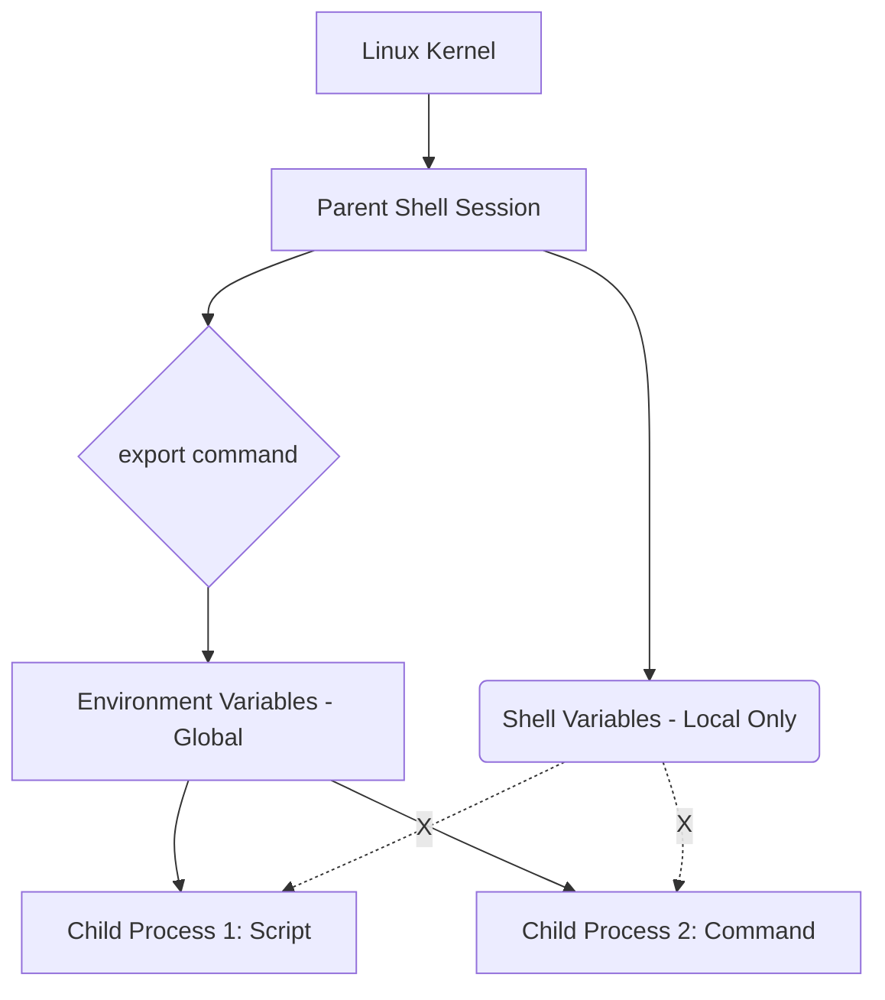

# Linux Shell Basics: Variables, Redirection, Pipes & PATH

← [Back to Linux Commands](../index.md)

---

This page explains how the Linux shell works, including different shell types, variables, and the powerful operators that allow you to chain commands together.

---

## 🏛️ Types of Shell

The shell is a command-line interpreter that acts as an interface between the user and the operating system kernel.

- **sh**: The original Bourne shell.
- **bash (Bourne Again Shell)**: The default shell for most Linux distributions.
- **zsh**: A highly customizable shell popular for modern development.
- **ksh (Korn Shell)**: A powerful shell often used in enterprise environments.
- **csh**: A C-like syntax shell.

### 🔍 Pro-Tip: Identifying Available Shells
You can list all valid login shells installed on your system by inspecting the `/etc/shells` file:
```bash
[opc@new-k8s ~]$ cat /etc/shells
/bin/sh
/bin/bash
/usr/bin/sh
/usr/bin/bash
```

---

## 📊 Shell Variable Architecture

Understanding the difference between **Shell Variables** (local) and **Environment Variables** (global) is critical for managing processes and automation scripts.



---

## 🛠️ Creating Shell Variables

Shell variables are only accessible within the current shell session.

```
[opc@new-k8s ~]$ clear
[opc@new-k8s ~]$ NAME="vignesh"
[opc@new-k8s ~]$ echo $NAME
vignesh
[opc@new-k8s ~]$ printenv NAME      # Returns nothing
[opc@new-k8s ~]$ env | grep NAME    # Returns nothing
```

Local variables are strictly session-bound and are **not** part of the system environment. Therefore, commands like `env` or `printenv` will not display them.

### 🧪 Proving Local Scope (Subshells)
A powerful way to prove that shell variables are local is to start a new "child" shell session. The child will not inherit the parent's local variables.

```bash
[opc@new-k8s ~]$ MY_ROLE="DevOps"
[opc@new-k8s ~]$ echo $MY_ROLE
DevOps
[opc@new-k8s ~]$ bash                # Enter a new child shell
[opc@new-k8s ~]$ echo $MY_ROLE       # Attempt to read variable
                                     # (Output is empty)
[opc@new-k8s ~]$ exit                # Return to parent shell
[opc@new-k8s ~]$ echo $MY_ROLE
DevOps
```

---

## 🌎 Managing Environment Variables using `export`

Environment variables are accessible to child processes as well.

### 1. Creating an Environment Variable

```
[opc@new-k8s ~]$ export NEW_NAME="Raghav"
[opc@new-k8s ~]$ echo $NEW_NAME
Raghav
[opc@new-k8s ~]$ printenv NEW_NAME
Raghav
[opc@new-k8s ~]$ env | grep NEW_NAME
NEW_NAME=Raghav
```

### 🧪 Proving Global Scope (Subshells)
Unlike local shell variables, environment variables are inherited by child processes.

```bash
[opc@new-k8s ~]$ export APP_STAGE="production"
[opc@new-k8s ~]$ bash                # Enter a new child shell
[opc@new-k8s ~]$ echo $APP_STAGE     # Read inherited variable
production                           # (Variable IS available)
[opc@new-k8s ~]$ exit                # Return to parent shell
```

### 2. Viewing Environment Variables
You can view a single variable with `echo` or list all environment variables using `env` or `printenv`.

```bash
[opc@new-k8s test]$ echo $PATH
/usr/local/bin:/usr/bin:/usr/local/sbin:/usr/sbin:/home/opc/.local/bin:/home/opc/bin
```

```bash
[opc@new-k8s test]$ env
XDG_SESSION_ID=172502
HOSTNAME=new-k8s
SELINUX_ROLE_REQUESTED=
TERM=xterm
SHELL=/bin/bash
HISTSIZE=1000
SELINUX_USE_CURRENT_RANGE=
SSH_TTY=/dev/pts/0
USER=opc
MAIL=/var/spool/mail/opc
PATH=/usr/local/bin:/usr/bin:/usr/local/sbin:/usr/sbin:/home/opc/.local/bin:/home/opc/bin
PWD=/home/opc
LANG=en_US.UTF-8
NEW_NAME=Raghav
SELINUX_LEVEL_REQUESTED=
HISTCONTROL=ignoredups
SHLVL=1
```

---

## 📍 The PATH Environment Variable

Most Linux commands can be executed from any directory because their paths are added to the `PATH` environment variable.

```
[opc@new-k8s ~]$ echo $PATH
/usr/local/bin:/usr/bin:/usr/local/sbin:/usr/sbin:/home/opc/.local/bin:/home/opc/bin
```

---

## 🔄 Shell Operators: Redirection

Redirection allows you to capture command output and save it to files.

```
>  Overwrites the file content, if the file already exists
>> Appends the content to the existing content in the file
```

In both cases, if the file is not present, it will create the file and write the content to it. By default, the `echo` command prints the output to the screen. But if we use redirection arrows, it can store the output to files.

### 1. Overwrite (`>`)
```
[opc@new-k8s ~]$ mkdir redirection
[opc@new-k8s ~]$ cd redirection/
[opc@new-k8s redirection]$ pwd
/home/opc/redirection
[opc@new-k8s redirection]$ ll
total 0
[opc@new-k8s redirection]$ pwd
/home/opc/redirection
[opc@new-k8s redirection]$ echo "hello devops"    # Prints to terminal
hello devops
[opc@new-k8s redirection]$ echo "hello devops" > hello.txt   # Redirects to file
[opc@new-k8s redirection]$ cat hello.txt
hello devops
[opc@new-k8s redirection]$ echo "I am learning devops" > hello.txt
[opc@new-k8s redirection]$ cat hello.txt
I am learning devops
```

### 2. Append (`>>`)
```
[opc@new-k8s redirection]$ pwd
/home/opc/redirection
[opc@new-k8s redirection]$ ll
total 0
[opc@new-k8s redirection]$ echo "I eat fruits daily" >> double-arrow.txt
[opc@new-k8s redirection]$ ll
total 4
-rw-rw-r--. 1 opc opc 19 Apr 17 14:13 double-arrow.txt
[opc@new-k8s redirection]$ cat double-arrow.txt
I eat fruits daily
[opc@new-k8s redirection]$ echo "I love banana" >> double-arrow.txt
[opc@new-k8s redirection]$ echo "I also like apples" >> double-arrow.txt
[opc@new-k8s redirection]$ ll
total 4
-rw-rw-r--. 1 opc opc 52 Apr 17 14:13 double-arrow.txt
[opc@new-k8s redirection]$ cat double-arrow.txt
I eat fruits daily
I love banana
I also like apples
```

---

## 🔗 Shell Operators: Pipe (`|`)

A pipe (`|`) is used to pass the output from one command/program to the input for another command. This is essential for filtering long lists of information.

### Example: Searching for Environment Variables
If you run `env` alone, the output is often dozens of lines long. To find a specific variable like your home directory, you can pipe the output to `grep`.

```bash
[opc@new-k8s test]$ env | grep HOME
HOME=/home/opc
```

---

## 📜 Creating a Shell Script and Exporting to PATH

Create a script named `sysinfo.sh` that prints the current date and user.

Run `echo -e '#!/bin/bash\ndate\nwhoami' > sysinfo.sh`.

Verify the file creation and content:
```bash
[opc@new-k8s ~]$ ls -l sysinfo.sh
-rw-rw-r--. 1 opc opc 24 Apr 27 12:00 sysinfo.sh
[opc@new-k8s ~]$ cat sysinfo.sh
#!/bin/bash
date
whoami
```

### Making it Executable and Running Locally
After creating the script, you need to give it execute permissions.

```bash
[opc@new-k8s ~]$ chmod +x sysinfo.sh
[opc@new-k8s ~]$ ls -l sysinfo.sh
-rwxrwxr-x. 1 opc opc 24 Apr 27 12:05 sysinfo.sh
```

Now, try to run the script by just typing its name:
```bash
[opc@new-k8s ~]$ sysinfo.sh
bash: sysinfo.sh: command not found...
```
It fails! This is because the current directory (`.`) is not in your `PATH`. To run it from the current directory, you must specify the path explicitly using `./`:

```bash
[opc@new-k8s ~]$ ./sysinfo.sh
Sat Apr 27 12:10:00 GMT 2026
opc
```

### Making the Script Globally Accessible (PATH)
If you want to run `sysinfo.sh` from any directory without typing `./`, you must add its directory to the `PATH` environment variable.

First, let's move to a different directory and see it fail again:
```bash
[opc@new-k8s ~]$ cd /tmp
[opc@new-k8s tmp]$ sysinfo.sh
bash: sysinfo.sh: command not found...
```

Now, let's check the current `PATH` and add `/home/opc` to it:
```bash
[opc@new-k8s tmp]$ echo $PATH
/usr/local/bin:/usr/bin:/usr/local/sbin:/usr/sbin:/home/opc/.local/bin:/home/opc/bin

[opc@new-k8s tmp]$ export PATH=$PATH:/home/opc

[opc@new-k8s tmp]$ echo $PATH
/usr/local/bin:/usr/bin:/usr/local/sbin:/usr/sbin:/home/opc/.local/bin:/home/opc/bin:/home/opc
```

Now that the directory is in the `PATH`, the script can be executed from anywhere:
```bash
[opc@new-k8s tmp]$ sysinfo.sh
Sat Apr 27 12:12:00 GMT 2026
opc
```

---

## 💾 Persisting Environment Variables (.bashrc)

Manual changes to environment variables are lost when you close your terminal. To make them permanent, add them to your `~/.bashrc` file.

### 📜 Adding Variables to .bashrc

```bash
[opc@new-k8s ~]$ echo 'export APP_STAGE="production"' >> ~/.bashrc
[opc@new-k8s ~]$ source ~/.bashrc   # Apply changes immediately
```

#### 🧪 Proving Persistence
To verify the variable is now permanent, enter a new child shell.

```bash
[opc@new-k8s ~]$ bash                # Enter child shell
[opc@new-k8s ~]$ echo $APP_STAGE     # Variable is available!
production
[opc@new-k8s ~]$ exit                # Return to parent
```

```bash
[opc@new-k8s ~]$ cat .bashrc
# .bashrc

# Source global definitions
if [ -f /etc/bashrc ]; then
        . /etc/bashrc
fi

# User specific aliases and functions

export APP_STAGE="production"
export NEW_NAME="Raghav"
```

```bash
[opc@new-k8s ~]$ myls
Sat Apr 15 11:21:19 GMT 2023
total 3072008
-rw-rw-r--. 1 opc  opc            852 Apr 15 03:15 fruits.txt
-rwxrwxr-x. 1 opc  opc             48 Apr 15 10:56 myinfo
drwxrwxr-x. 2 opc  opc             25 Nov 26  2021 prometheus
-rw-rw----. 1 opc  vignesh          0 Apr 15 04:19 random.txt
-rw-r--r--. 1 root root    3145728000 Jan 11  2022 swapfile
drwxrwxr-x. 4 opc  vignesh        100 Apr 13 12:46 test
[opc@new-k8s ~]$ echo $NEW_NAME
Raghav
```

---

## 🚦 Exit Codes (`$?`)

`$?` is a special variable which holds the status code of the last executed command. In Linux, `0` means success, any other value indicates failure.

## ❓ Exit Status Code ($?)
Every command returns an exit status code after execution.
*   `0`: Success
*   Non-zero: Error (usually 1-255)

```bash
[opc@new-k8s ~]$ ls
sysinfo.sh
[opc@new-k8s ~]$ echo $?      # Success code
0
[opc@new-k8s ~]$ ls /fake-dir
ls: cannot access '/fake-dir': No such file or directory
[opc@new-k8s ~]$ echo $?      # Error code
2
```

---

## 🧠 Quick Quiz — Shell Basics & Environment

<quiz>
Which environment variable determines where Linux looks for executable commands?
- [ ] HOME
- [x] PATH
- [ ] SHELL
- [ ] USER

The PATH variable contains directories where executable commands are searched.
</quiz>

---

### 📝 Want More Practice?

To strengthen your understanding and prepare for interviews, try the **full 20-question practice quiz** based on this chapter:

👉 **[Start Shell Basics & Environment Quiz (20 Questions)](../../quiz/linux-commands/linux-shell-env-alias/index.md)**

---


