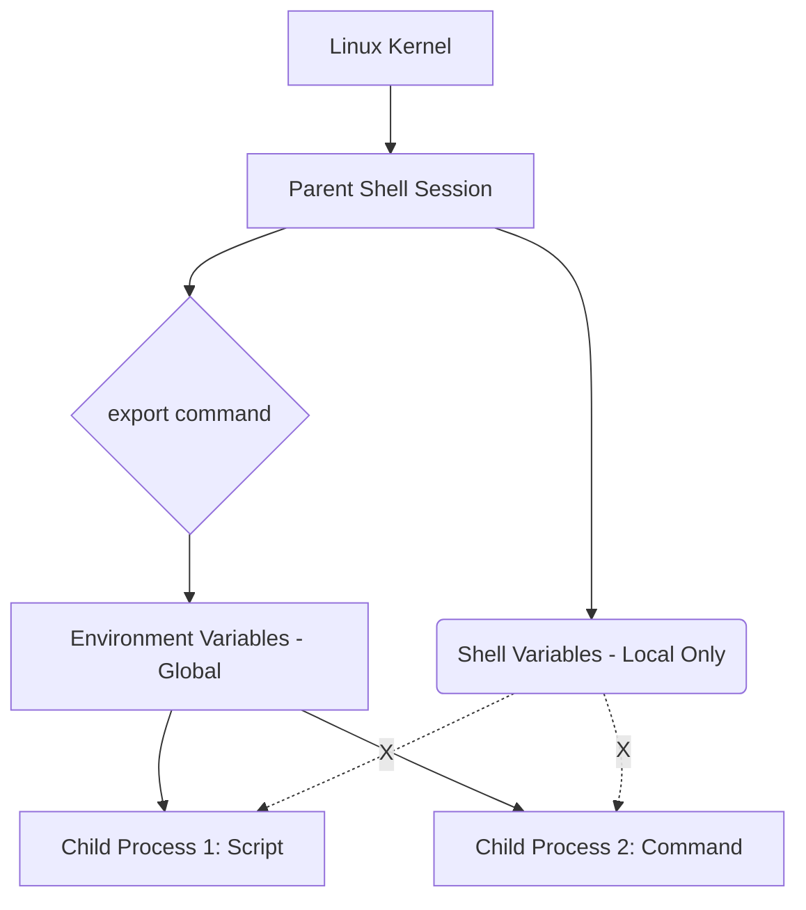

# Linux Shell Mastery: Variables, Redirection, Pipes & Aliases

← [Back to Linux Commands](../index.md)

---

This page explains how the Linux shell works, including different shell types, variables, and the powerful operators that allow you to chain commands together.

---

## 🏛️ Types of Shell

The shell is a command-line interpreter that acts as an interface between the user and the operating system kernel.

- **sh**: The original Bourne shell.
- **bash (Bourne Again Shell)**: The default shell for most Linux distributions.
- **zsh**: A highly customizable shell popular for modern development.
- **ksh (Korn Shell)**: A powerful shell often used in enterprise environments.
- **csh**: A C-like syntax shell.

Reference: [https://www.shiksha.com/online-courses/articles/introduction-to-types-of-shell/](https://www.shiksha.com/online-courses/articles/introduction-to-types-of-shell/)

---

## 📊 Shell Variable Architecture

Understanding the difference between **Shell Variables** (local) and **Environment Variables** (global) is critical for managing processes and automation scripts.



---

## 🛠️ Creating Shell Variables

Shell variables are only accessible within the current shell session.

```
[opc@new-k8s ~]$ clear
[opc@new-k8s ~]$ NAME="vignesh"
[opc@new-k8s ~]$ echo $NAME
vignesh
[opc@new-k8s ~]$ printenv NAME

printenv NAME   -- doesn't show anything, since it's not an environment variable

Even in env, printenv command the NAME variable will not been shown
```

---

## 🌎 Managing Environment Variables using `export`

Environment variables are accessible to child processes as well.

### 1. Creating an Environment Variable
```
[opc@new-k8s ~]$ export NEW_NAME="Raghav"
[opc@new-k8s ~]$ echo $NEW_NAME
Raghav
[opc@new-k8s ~]$ printenv NEW_NAME
Raghav
```

### 2. Viewing Environment Variables
You can view a single variable with `echo` or list all environment variables using `env` or `printenv`.

```bash
[opc@new-k8s test]$ echo $PATH
/usr/local/bin:/usr/bin:/usr/local/sbin:/usr/sbin:/home/opc/.local/bin:/home/opc/bin
```

```bash
[opc@new-k8s test]$ env
XDG_SESSION_ID=172502
HOSTNAME=new-k8s
SELINUX_ROLE_REQUESTED=
TERM=xterm
SHELL=/bin/bash
HISTSIZE=1000
SELINUX_USE_CURRENT_RANGE=
SSH_TTY=/dev/pts/0
USER=opc
MAIL=/var/spool/mail/opc
PATH=/usr/local/bin:/usr/bin:/usr/local/sbin:/usr/sbin:/home/opc/.local/bin:/home/opc/bin
PWD=/home/opc
LANG=en_US.UTF-8
NEW_NAME=Raghav
SELINUX_LEVEL_REQUESTED=
HISTCONTROL=ignoredups
SHLVL=1
```

---

## 📍 The PATH Environment Variable

Most Linux commands can be executed from any directory because their paths are added to the `PATH` environment variable.

```
[opc@new-k8s ~]$ echo $PATH
/usr/local/bin:/usr/bin:/usr/local/sbin:/usr/sbin:/home/opc/.local/bin:/home/opc/bin
```

---

## 🔄 Shell Operators: Redirection

Redirection allows you to capture command output and save it to files.

```
>  Overwrites the file content, if the file already exists
>> Appends the content to the existing content in the file
```

In both cases, if the file is not present, it will create the file and write the content to it. By default, the `echo` command prints the output to the screen. But if we use redirection arrows, it can store the output to files.

### 1. Overwrite (`>`)
```
[opc@new-k8s ~]$ mkdir redirection
[opc@new-k8s ~]$ cd redirection/
[opc@new-k8s redirection]$ pwd
/home/opc/redirection
[opc@new-k8s redirection]$ ll
total 0
[opc@new-k8s redirection]$ echo "hello devops" > hello.txt
[opc@new-k8s redirection]$ ll
total 4
-rw-rw-r--. 1 opc opc 13 Apr 17 14:11 hello.txt
[opc@new-k8s redirection]$ cat hello.txt
hello devops
[opc@new-k8s redirection]$ echo "I am learning devops" > hello.txt
[opc@new-k8s redirection]$ ll
total 4
-rw-rw-r--. 1 opc opc 21 Apr 17 14:11 hello.txt
[opc@new-k8s redirection]$ cat hello.txt
I am learning devops
```

### 2. Append (`>>`)
```
[opc@new-k8s redirection]$ pwd
/home/opc/redirection
[opc@new-k8s redirection]$ ll
total 0
[opc@new-k8s redirection]$ echo "I eat fruits daily" >> double-arrow.txt
[opc@new-k8s redirection]$ ll
total 4
-rw-rw-r--. 1 opc opc 19 Apr 17 14:13 double-arrow.txt
[opc@new-k8s redirection]$ cat double-arrow.txt
I eat fruits daily
[opc@new-k8s redirection]$ echo "I love banana" >> double-arrow.txt
[opc@new-k8s redirection]$ echo "I also like apples" >> double-arrow.txt
[opc@new-k8s redirection]$ ll
total 4
-rw-rw-r--. 1 opc opc 52 Apr 17 14:13 double-arrow.txt
[opc@new-k8s redirection]$ cat double-arrow.txt
I eat fruits daily
I love banana
I also like apples
```

---

## 🔗 Shell Operators: Pipe (`|`)

A pipe (`|`) is used to pass the output from one command/program to the input for another command.

```
[opc@new-k8s test]$ pwd
/home/opc/test
[opc@new-k8s test]$ ll
total 8
drwxrwxr-x. 2 opc opc 27 Mar 17 14:03 client
-rw-rw-r--. 1 opc opc 77 Apr 12 12:26 Dockerfile
-rw-rw-r--. 1 opc opc  0 Apr 12 12:54 hello.txt
-rw-rw-r--. 1 opc opc 23 Apr 12 12:56 mani.txt
-rw-rw-r--. 1 opc opc  0 Mar 17 14:03 server
drwxrwxr-x. 3 opc opc 18 Apr 13 12:46 vignesh
[opc@new-k8s test]$ ll | wc -l
7
```

---

## 📜 Creating a Shell Script and Exporting to PATH

We will create a shell script to print the username, hostname, date, present working directory, and the files in that directory.

**Filename:** `myinfo`
```bash
#!/bin/bash

echo $USER
hostname
date
pwd
ls -l
```

### Making it Executable and Testing PATH
```bash
[opc@new-k8s ~]$ ll
total 3072008
-rw-rw-r--. 1 opc  opc            852 Apr 15 03:15 fruits.txt
-rw-rw-r--. 1 opc  opc             48 Apr 15 10:56 myinfo
drwxrwxr-x. 2 opc  opc             25 Nov 26  2021 prometheus
-rw-rw----. 1 opc  vignesh          0 Apr 15 04:19 random.txt
-rw-r--r--. 1 root root    3145728000 Jan 11  2022 swapfile
drwxrwxr-x. 4 opc  vignesh        100 Apr 13 12:46 test
[opc@new-k8s ~]$ cat myinfo
#!/bin/bash

echo $USER
hostname
date
pwd
ls -l
[opc@new-k8s ~]$ chmod +x myinfo
[opc@new-k8s ~]$ ll
total 3072008
-rw-rw-r--. 1 opc  opc            852 Apr 15 03:15 fruits.txt
-rwxrwxr-x. 1 opc  opc             48 Apr 15 10:56 myinfo
drwxrwxr-x. 2 opc  opc             25 Nov 26  2021 prometheus
-rw-rw----. 1 opc  vignesh          0 Apr 15 04:19 random.txt
-rw-r--r--. 1 root root    3145728000 Jan 11  2022 swapfile
drwxrwxr-x. 4 opc  vignesh        100 Apr 13 12:46 test
[opc@new-k8s ~]$ myinfo
bash: myinfo: command not found
[opc@new-k8s ~]$ ./myinfo
opc
new-k8s
Sat Apr 15 10:56:49 GMT 2023
/home/opc
total 3072008
-rw-rw-r--. 1 opc  opc            852 Apr 15 03:15 fruits.txt
-rwxrwxr-x. 1 opc  opc             48 Apr 15 10:56 myinfo
drwxrwxr-x. 2 opc  opc             25 Nov 26  2021 prometheus
-rw-rw----. 1 opc  vignesh          0 Apr 15 04:19 random.txt
-rw-r--r--. 1 root root    3145728000 Jan 11  2022 swapfile
drwxrwxr-x. 4 opc  vignesh        100 Apr 13 12:46 test
[opc@new-k8s ~]$ pwd
/home/opc
[opc@new-k8s ~]$ echo $PATH
/usr/local/bin:/usr/bin:/usr/local/sbin:/usr/sbin:/home/opc/.local/bin:/home/opc/bin
[opc@new-k8s ~]$ export PATH=$PATH:/home/opc
[opc@new-k8s ~]$
[opc@new-k8s ~]$
[opc@new-k8s ~]$ myinfo
opc
new-k8s
Sat Apr 15 10:57:54 GMT 2023
/home/opc
total 3072008
-rw-rw-r--. 1 opc  opc            852 Apr 15 03:15 fruits.txt
-rwxrwxr-x. 1 opc  opc             48 Apr 15 10:56 myinfo
drwxrwxr-x. 2 opc  opc             25 Nov 26  2021 prometheus
-rw-rw----. 1 opc  vignesh          0 Apr 15 04:19 random.txt
-rw-r--r--. 1 root root    3145728000 Jan 11  2022 swapfile
drwxrwxr-x. 4 opc  vignesh        100 Apr 13 12:46 test
[opc@new-k8s ~]$
[opc@new-k8s ~]$
[opc@new-k8s ~]$ cd /tmp
[opc@new-k8s tmp]$ pwd
/tmp
[opc@new-k8s tmp]$ ll
total 4
-rw-------. 1 root root 1097 Apr 15 10:02 dhclient-exit-hooksRZi.log
drwx------. 3 root root   17 Jul  4  2021 systemd-private-c60b800098604975be26dbbb3215bd47-chronyd.service-ZzaKpF
drwx------. 3 root root   17 Mar 27 20:01 systemd-private-c60b800098604975be26dbbb3215bd47-unified-monitoring-agent.service-561YDH
-rw-rw-r--. 1 opc  opc     0 Apr 12 12:30 vignesh.txt
[opc@new-k8s tmp]$ myinfo
opc
new-k8s
Sat Apr 15 10:58:09 GMT 2023
/tmp
total 4
-rw-------. 1 root root 1097 Apr 15 10:02 dhclient-exit-hooksRZi.log
drwx------. 3 root root   17 Jul  4  2021 systemd-private-c60b800098604975be26dbbb3215bd47-chronyd.service-ZzaKpF
drwx------. 3 root root   17 Mar 27 20:01 systemd-private-c60b800098604975be26dbbb3215bd47-unified-monitoring-agent.service-561YDH
-rw-rw-r--. 1 opc  opc     0 Apr 12 12:30 vignesh.txt
```

---

## ⚡ Alias Command

Aliases allow you to create shortcut commands. We will create a command named `myls` which will print the current date and list files.

```
[opc@new-k8s tmp]$ alias myls="date && ls -l"
[opc@new-k8s tmp]$ myls
Sat Apr 15 11:01:37 GMT 2023
dhclient-exit-hooksRZi.log                                               systemd-private-c60b800098604975be26dbbb3215bd47-unified-monitoring-agent.service-561YDH
systemd-private-c60b800098604975be26dbbb3215bd47-chronyd.service-ZzaKpF  vignesh.txt
```

---

## 💾 Persisting Environment Variables and Aliases (.bashrc)

Manually exported environment variables and aliases will be lost once the terminal session is closed. The `.bashrc` file in the user's home directory is executed every time a new terminal session is started. By placing commands in the `.bashrc` file, they will be automatically executed for every new session.

### .bashrc file
```
[opc@new-k8s ~]$ clear
[opc@new-k8s ~]$ pwd
/home/opc
[opc@new-k8s ~]$ ls -lart
total 3072064
-rw-r--r--.  1 opc  opc            193 Nov 22  2019 .bash_profile
-rw-r--r--.  1 opc  opc             18 Nov 22  2019 .bash_logout
-rw-r--r--.  1 opc  opc            172 Apr  2  2020 .kshrc
drwxr-xr-x.  3 opc  docker          33 Jul  4  2021 .kube
drwxrw----.  3 opc  opc             19 Jul  4  2021 .pki
drwxrwxr-x.  4 opc  opc             30 Nov 26  2021 .config
drwxrwxr-x.  4 opc  opc             30 Nov 26  2021 .cache
drwxrwxr-x.  2 opc  opc             25 Nov 26  2021 prometheus
-rw-r--r--.  1 root root    3145728000 Jan 11  2022 swapfile
drwxrwxr-x.  4 opc  opc             82 Jan 11  2022 .docker
drwx------.  2 opc  opc             80 May 26  2022 .ssh
drwxr-xr-x.  4 root root            32 Apr 13 12:25 ..
drwxrwxr-x.  4 opc  vignesh        100 Apr 13 12:46 test
-rw-rw-r--.  1 opc  opc            852 Apr 15 03:15 fruits.txt
-rw-rw----.  1 opc  vignesh          0 Apr 15 04:19 random.txt
-rwxrwxr-x.  1 opc  opc             48 Apr 15 10:56 myinfo
-rw-r--r--.  1 opc  opc            285 Apr 15 11:19 .bashrc
-rw-------.  1 opc  opc           6596 Apr 15 11:19 .viminfo
drwxr-x---. 10 opc  opc           4096 Apr 15 11:19 .
-rw-------.  1 opc  opc          26674 Apr 15 11:19 .bash_history
[opc@new-k8s ~]$ cat .bashrc
# .bashrc

# Source global definitions
if [ -f /etc/bashrc ]; then
        . /etc/bashrc
fi

# Uncomment the following line if you don't like systemctl's auto-paging feature:
# export SYSTEMD_PAGER=

# User specific aliases and functions

export NEW_NAME="Raghav"
alias myls="date && ls -l"
[opc@new-k8s ~]$ myls
Sat Apr 15 11:21:19 GMT 2023
total 3072008
-rw-rw-r--. 1 opc  opc            852 Apr 15 03:15 fruits.txt
-rwxrwxr-x. 1 opc  opc             48 Apr 15 10:56 myinfo
drwxrwxr-x. 2 opc  opc             25 Nov 26  2021 prometheus
-rw-rw----. 1 opc  vignesh          0 Apr 15 04:19 random.txt
-rw-r--r--. 1 root root    3145728000 Jan 11  2022 swapfile
drwxrwxr-x. 4 opc  vignesh        100 Apr 13 12:46 test
[opc@new-k8s ~]$ echo $NEW_NAME
Raghav
```

---

## 🚦 Exit Codes (`$?`)

`$?` is a special variable which holds the status code of the last executed command. In Linux, `0` means success, any other value indicates failure.

```
[opc@new-k8s ~]$ ll
total 3072008
-rw-rw-r--. 1 opc  opc         852 Apr 15 03:15 fruits.txt
-rwxrwxr-x. 1 opc  opc          81 Apr 15 13:27 newtest
drwxrwxr-x. 2 opc  opc          25 Nov 26  2021 prometheus
-rw-r--r--. 1 root root 3145728000 Jan 11  2022 swapfile
drwxrwxr-x. 4 opc  opc         100 Apr 15 13:04 test
[opc@new-k8s ~]$ echo $?
0
[opc@new-k8s ~]$ ddhghg
-bash: ddhghg: command not found
[opc@new-k8s ~]$ echo $?
127
```

---

## 🧠 Quick Quiz — Shell Basics & Environment

<quiz>
Which environment variable determines where Linux looks for executable commands?
- [ ] HOME
- [x] PATH
- [ ] SHELL
- [ ] USER

The PATH variable contains directories where executable commands are searched.
</quiz>

---

### 📝 Want More Practice?

To strengthen your understanding and prepare for interviews, try the **full 20-question practice quiz** based on this chapter:

👉 **[Start Shell Basics & Environment Quiz (20 Questions)](../../quiz/linux-commands/linux-shell-env-alias/index.md)**

---


