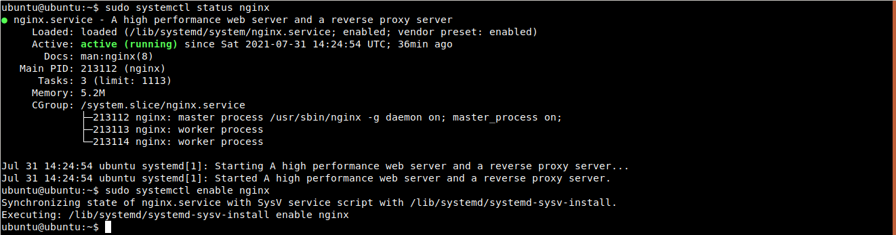
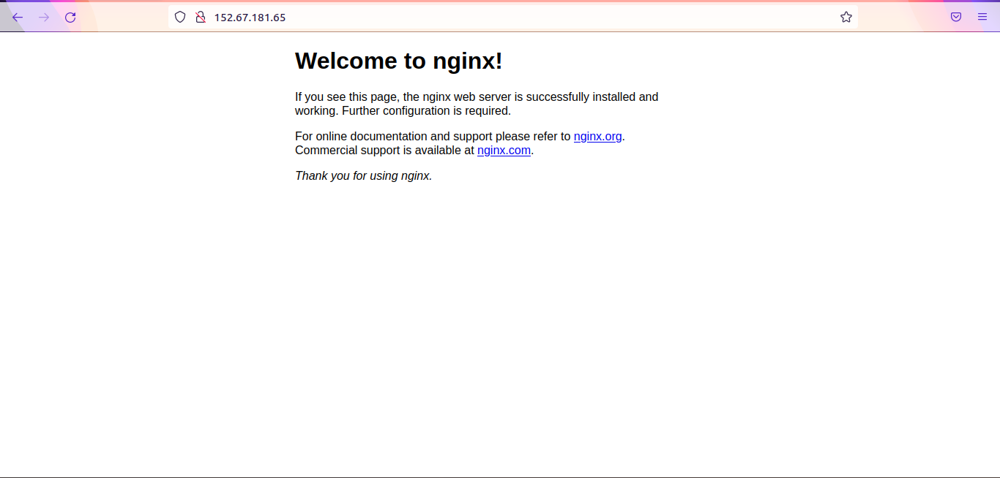
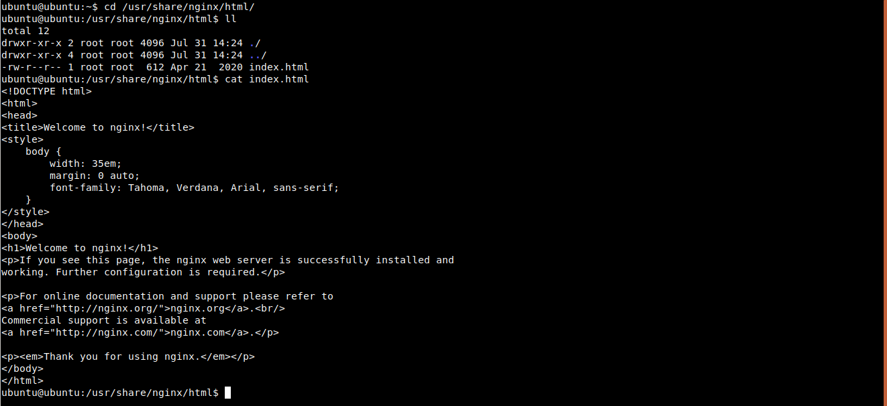

#### What is Nginx ?

Nginx is an open source web server. Which is used to serve html, css and Js files

#### Install nginx webserver

`On Ubuntu Operating system`

```
sudo apt update
sudo apt nginx -y
```

Check the status of nginx service and enable nginx service

```
sudo systemctl status nginx
sudo systemctl enable nginx
```



By default nginx webserver start on port 80. Now we can access the nginx webserver application by `http://ip-address:80` in browser.

You can also access the application directly by ip-address without mentioning port like this `http://ip-address`

This is because, if we are not specifying the port, by default it uses port 80 for http request and port 443 for https request.



This default homepage is served from /usr/share/nginx/html/index.html



Default nginx configuration is located in /etc/nginx/nginx.conf file
