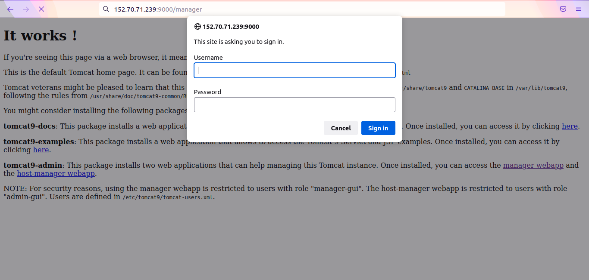
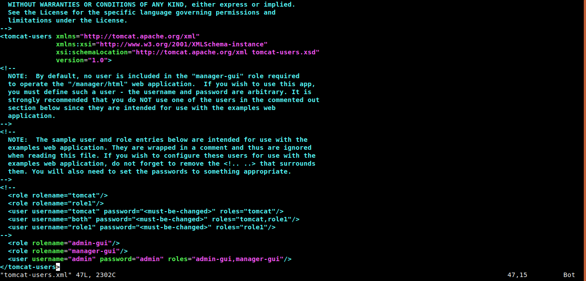
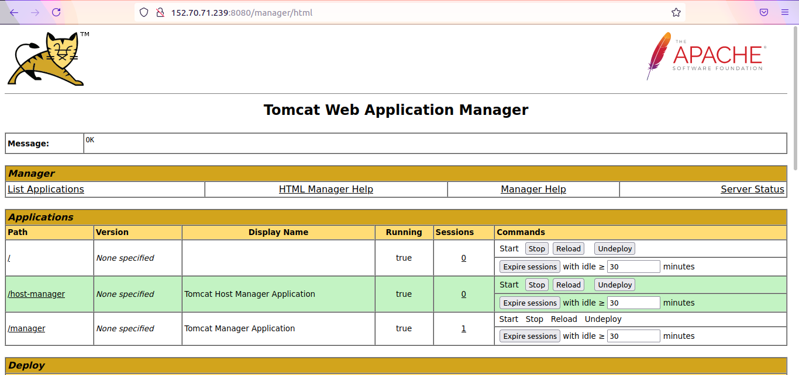
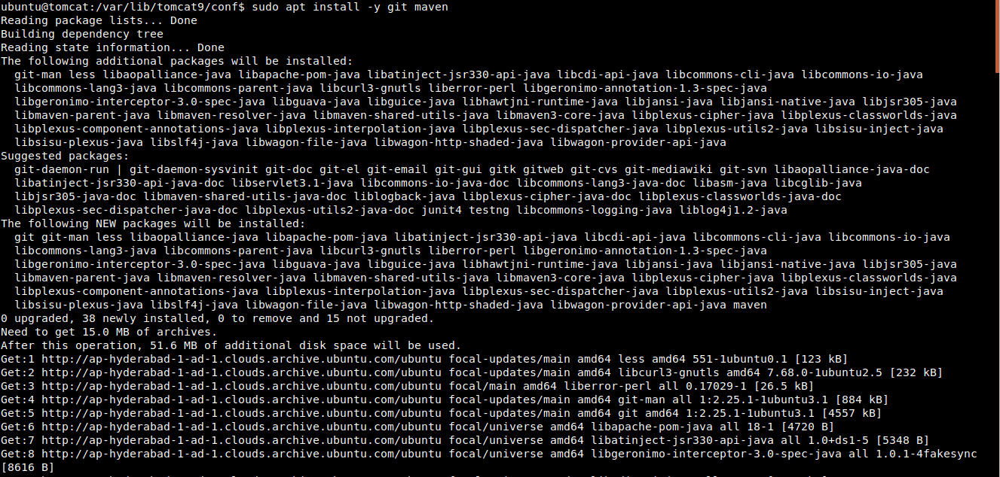
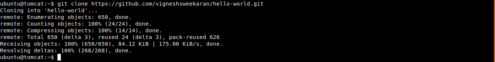
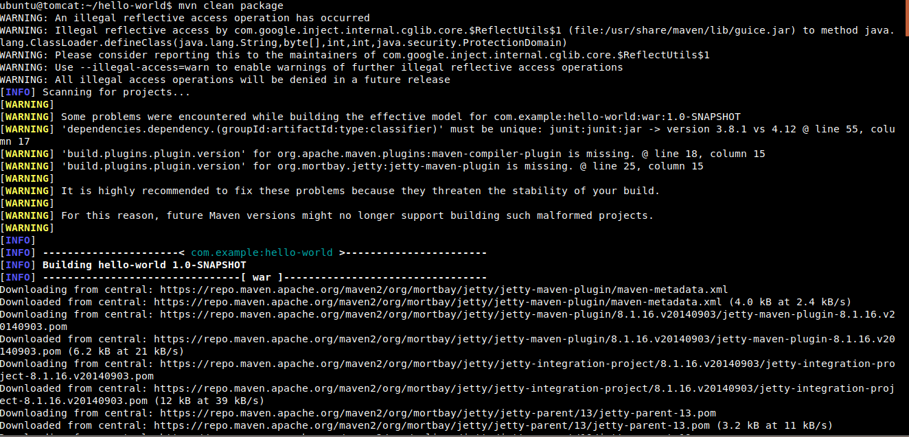
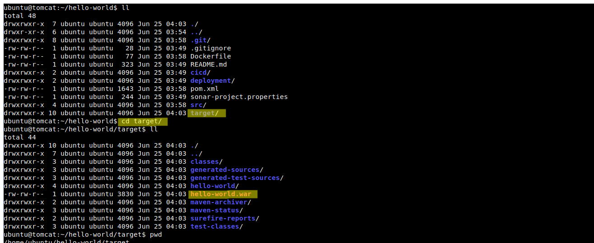
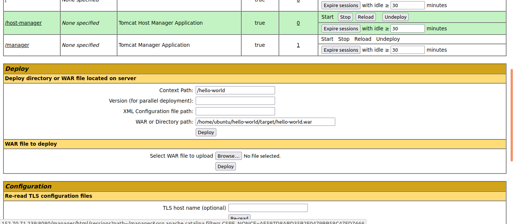
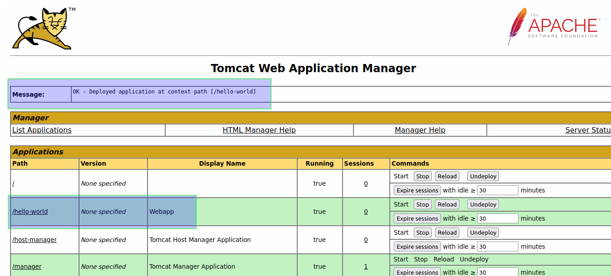
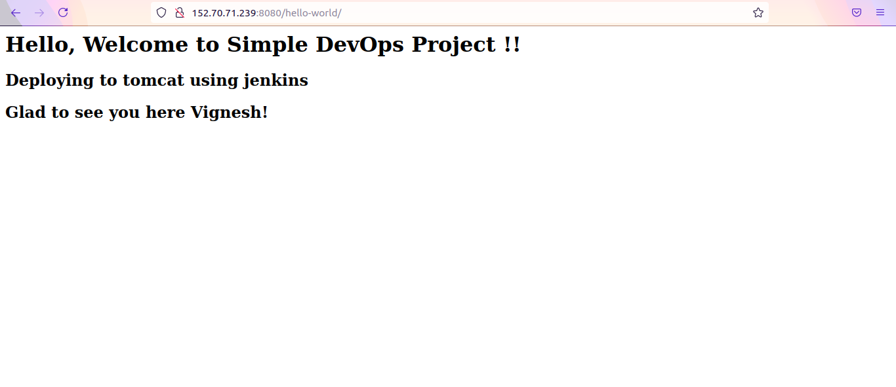

### References:

- [How to install Tomcat](../installation/index.md)

### How to access the Manager GUI in Tomcat 9 webserver

After installation if we directly try to access the web application manager, it will ask for username and password.

Access the manger application by [http://your-ip-address:8080/manager](http://your-ip-address:8080/manager) in browser



To create users in Tomcat, open the file **/var/lib/tomcat9/conf/tomcat-users.xml**

```
sudo vi /var/lib/tomcat9/conf/tomcat-users.xml
```

Go to end of the file and paste the following lines inside tomcat-users block and save it.

Here we have defined two roles **admin-gui** **manager-gui** and created user **admin** and assigned the roles to admin user

```
  <role rolename="admin-gui"/>
  <role rolename="manager-gui"/>
  <user username="admin" password="admin" roles="admin-gui,manager-gui"/>
```



Then restart the tomcat9

```
sudo systemctl restart tomcat9
```

Now go to you browser and type [http://your-ip-address:8080/manager](http://your-ip-address:8080/manager) enter username and password, you will see the tomcat manager GUI



Now to deploy the java web application to tomcat, we have to compile the Java code and package it to .war file extension type.

I have a sample hello-world maven project in github [hello-world](https://github.com/vigneshsweekaran/hello-world)

To download and compile this code we need two tools to be installed in our system **git** and **maven**

If you are using **Ubuntu** machine, you can easily install git and maven using following commands.

```
sudo apt install -y git maven
```



Now we can clone the **hello-world** project from Github

```
git clone https://github.com/vigneshsweekaran/hello-world.git
```



Go inside hello-world folder

```
cd hello-world
```

Now we can run the maven commands to compile the Java code and package it to .war file extension.

```
mvn clean package
```



After compilation, the **hello-world.war** file is generated in **target** folder



Now we have our artifact **hello-world.war** in **/home/ubuntu/hello-world/target** folder

Lets deploy the **hello-world.war** to tomact using Manager GUI

Goto Tomcat manager GUI --> **Deploy directory or WAR file located on server** section

Since we have our **hello-world.war** file in the same server. We will use this option.

Enter **/hello-world** in the **Context Path:** feild and war file absolute path /home/ubuntu/hello-world/target/hello-world.war in **WAR or Directory path:** feild



Now we can verify the deployment by checking the list in **Applications** section.



Now we can access the deployed application from browser by [http://your-ip-address:8080/hello-world](http://your-ip-address:8080/hello-world)



Hurray!! we have succesfully deployed the java web application manually to Tomcat 9 using Manager GUI

### Manager web application not opening - Fix

If manager application is not opening, paste the following content in

```
<Context antiResourceLocking="false" privileged="true" >
  <!--
    <Valve className="org.apache.catalina.valves.RemoteAddrValve"
         allow="127.d+.d+.d+|::1|0:0:0:0:0:0:0:1" />
  -->
  <Manager sessionAttributeValueClassNameFilter="java.lang.(?:Boolean|Integer|Long|Number|String)|org.apache.catalina.filters.CsrfPreventionFilter$LruCache(?:$1)?|java.util.(?:Linked)?HashMap"/>     
</Context>
```

---


